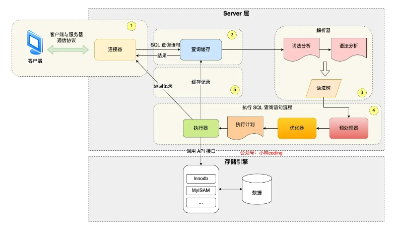
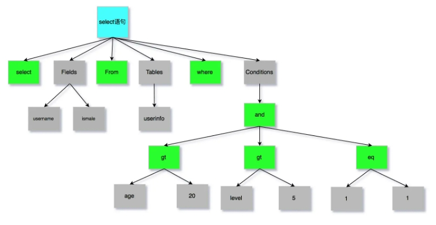
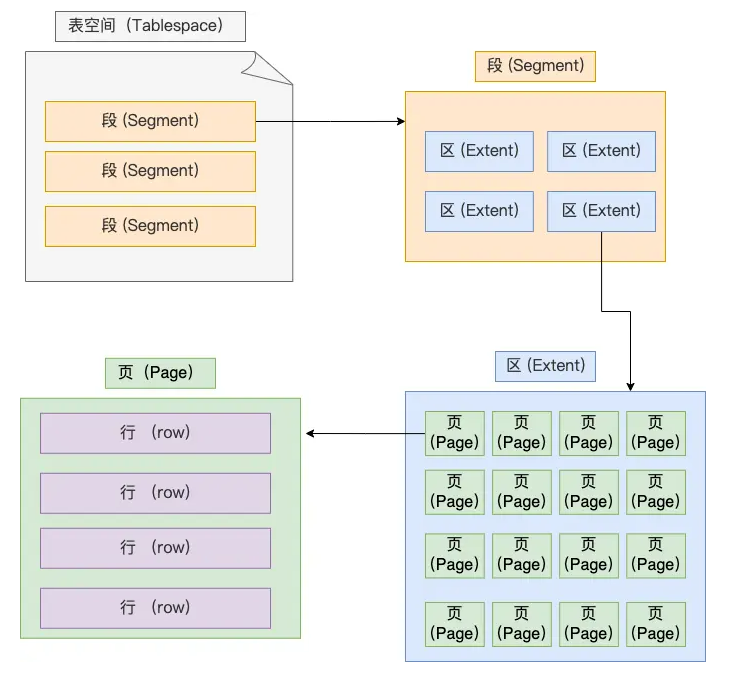
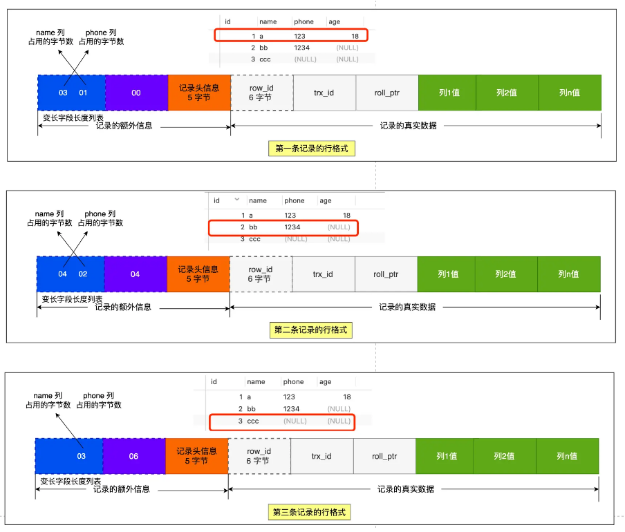
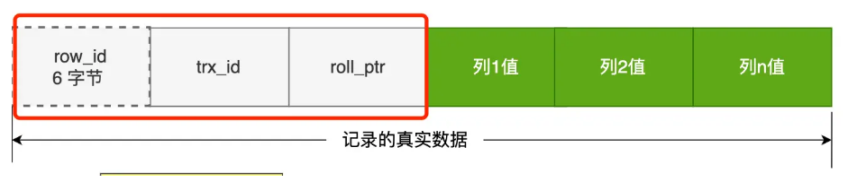
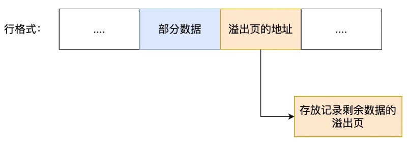
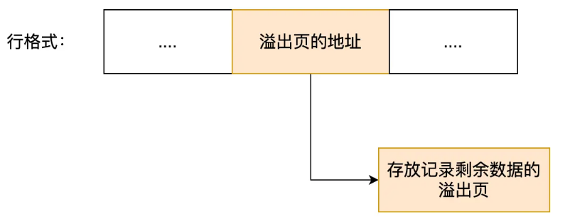

# 一、Mysql基础



Mysql的架构分为Server层和存储引擎层

- Server层负责建立连接，分析和执行SQL，包括查询缓存、解析器、优化器、执行器等
- 存储引擎负责数据的存储和提取

## 一、一条SQL的执行流程

- 客户端先通过连接器建立连接，连接器自会判断用户身份；
- 因为这是一条 update 语句，所以不需要经过查询缓存，但是表上有更新语句，是会把整个表的查询缓存清空的，所以说查询缓存很鸡肋，在 MySQL 8.0 就被移除这个功能了；
- 解析器会通过词法分析识别出关键字 update，表名等等，构建出语法树，接着还会做语法分析，判断输入的语句是否符合 MySQL 语法；
- 预处理器会判断表和字段是否存在；
- 优化器确定执行计划，因为 where 条件中的 id 是主键索引，所以决定要使用 id 这个索引；
- 执行器负责具体执行，找到这一行，然后更新。

### 一、连接器：

验证用户名密码，与mysql数据库建立连接，连接数由`max_connections`参数控制，读去用户权限

### 二、查询缓存：

缓存以key-value形式保存在内存中，key为SQL语句，values为SQL的查询结果，但因为只要有一个表有更新，缓存就会被清掉，很鸡肋，所以在mysql8.0以后删除了查询缓存

### 三、解析SQL：

```mysql
select username from userinfo
```

1. 词法分析：识别sql语句中的关键字（select，from）与非关键字（username，userinfo）

2. 语法分析：根据词法分析结果，语法解析器根据语法规则则，判断sql语句是否满足mysql语法，如果没问题构建sql语法树

   

### 四、执行SQL

1. 预处理阶段：检查表或字段是否存在，将select * 中的 * 符号扩展为表上的所有列
2. 优化阶段：基于查询成本的考虑，选择查询成本最小的执行计划
3. 执行阶段：根据执行计划执行sql语句，从存储引擎中读取记录，返回给客户端

## 二、数据是如何存储的

### 一、表空间文件的结构是怎么样的？



1. 行：

   数据以行的形式存储

2. 页：

   但是数据库的读取如果以行为单位效率太低，因此innoDB以页为单位读取数据，并将其整体存入内存，默认每个页16KB，也就是最多保证16KB的连续存储空间

3. 区： B+树种每一层都是通过双向链表连接的，如果以页为单位分配存储空间，那么链表中相邻的两页之间的物理位置并不是连续的，可能离得非常远，那么查询时就会有大量的随机I/O，增加查询时间。

   那么数据库就提出区的概念，每个区1MB，对于16KB的页来说，连续的64页放到一个区内，这样就使得链表中相邻的页的物理位置也相邻，就能使用顺序I/O

4. 段：

   表空间是由多个段组成，段由多个区组成，段分为：

   1. 索引段：存储B+树非叶子节点的区的集合
   2. 数据段：存放B+树叶子结点的区的集合
   3. 回滚段：存放回滚数据的区的集合

### 二、InnoDB的行格式

InnoDB提供了四种行格式，Redundant、Compact、Dynamic、Compressed行格式

Redundant是5.0之前所使用的的，已被淘汰，5.1以后用Compact格式

Dynamic、Compressed格式都与Compact格式接近，但从5.7以后默认使用Dynamic格式

### 三、Compact格式


1. 记录的额外信息

   1. 变长字段长度列表

      例如Varchar字段就是变长的，在数据库存储时要把变长字段的长度数据也存起来，才能方便我们在读取数据时根据`变长字段长度列表`去读取对应的长度数据

      ```mysql
      CREATE TABLE `t_user` (
        `id` int(11) NOT NULL,
        `name` VARCHAR(20) DEFAULT NULL,
        `phone` VARCHAR(20) DEFAULT NULL,
        `age` int(11) DEFAULT NULL,
        PRIMARY KEY (`id`) USING BTREE
      ) ENGINE = InnoDB DEFAULT CHARACTER SET = ascii ROW_FORMAT = COMPACT;
      ```

      | id   | name | phone  | age    |
      | ---- | ---- | ------ | ------ |
      | 1    | a    | 123    | 18     |
      | 2    | bb   | 1234   | (NULL) |
      | 3    | cc   | (NULL) | (NULL) |

      例：第一条数据

      - name 列的值为 a，真实数据占用的字节数是 1 字节，十六进制 0x01；
      - phone 列的值为 123，真实数据占用的字节数是 3 字节，十六进制 0x03；
      - age 列和 id 列不是变长字段，所以这里不用管。

   2. NULL值列表

      表中的列可能存储NULL值，把NULL值存储到真实数据中比较浪费时间，所以Compact行格式把这些值为NULL的列存储到NULL值列表中

      如果存在允许NULL值的列，则每个列对应一个二进制位(bit)，二进制位按照列的顺序逆序排列

      - 二进制的值为1时，代表该列的值为NULL
      - 二进制的值为0时，代表该列的值不为NULL

      另外，NULL值列表必须用整个8位的字节表示，如果使用二进制位个数不足整数个字节，则在高位补0

   我们把三条记录的 NULL 值列表都填充完毕后，它们的行格式是这样的：

   

   tips： 当列设置为`NOT NULL`时，这时候表里的行格式就不会有`NULL`值列表

   所以在设计数据库表的时候，通常都是建议将字段设置为 NOT NULL，这样可以至少节省 1 字节的空间（NULL 值列表至少占用 1 字节空间）。

   同时「NULL 值列表」的空间不是固定 1 字节的。当一条记录有 9 个字段值都是 NULL，那么就会创建 2 字节空间的「NULL 值列表」，以此类推。

2. 记录头信息

   - `delete_mask`：标识此条数据是否被删除，删除时delete_mask标记为1
   - `next_record`：下一条记录的位置，记录与记录之间是通过链表组织的，此处指向的是下一条记录的`记录头信息`和`真实数据`之间的位置，这样的好处是向左读就是记录头信息，向右读就是真实数据，比较方便，这也是`变长度字段列表`存储顺序逆序的原因
   - `record_type`：标识当前记录的类型，0标识普通记录，1表示B+树非叶子结点记录，2表示最小记录，3表示最大记录

3. 记录真实数据

   

   - row_id:

     当建表没有指定主键或者唯一约束列，那么就没有row_id隐藏字段了。row_id不是必需的，占用6个字节

   - trx_id：

     事务id，表示这个数据是由哪个事务生成的，trx_id是必需的，占6个字节

   - roll_pointer:

   这条记录上一个版本的指针。roll_pointer是必须的，占用7个字节

### 四、varchar(n)中n的最大取值是多少

**MySQL 规定除了 TEXT、BLOBs 这种大对象类型之外，其他所有的列（不包括隐藏列和记录头信息）占用的字节长度加起来不能超过 65535 个字节**。

1. 单字段的情况：当数据库中只有个varchar(n)列且字符集是`Ascii`时，最大字节长度等于65535-`变长字段长度列表`和`NULL列值列表`所占用的字节数

   每个变长字段的「变长字段长度」需要用多少字节表示？具体情况分为：

   - 条件一：如果变长字段允许存储的最大字节数小于等于 255 字节，就会用 1 字节表示「变长字段长度」；

   - 条件二：如果变长字段允许存储的最大字节数大于 255 字节，就会用 2 字节表示「变长字段长度」；

     65535-2-1 = 65532

     当字符集是utf-8时，一个字符占3个字节，varchar(n)的n最大取值就是 65532/3 = 21844

2. 多字段的情况：如果有多个字段的话，要保证所有字段的长度 + 变长字段字节数列表所占用的字节数 + NULL值列表所占用的字节数 <= 65535。

### 五、行溢出后，Mysql如何处理

Mysql中磁盘和内存交互的基本单位是页，一个页是16KB，也就是16384字节，而一个Varchar最多可存储65532个字节，如果是TEXT、BLOB可能存储更多的数据，这时一个页可能就存不了一条数据，这个时候就会发生行溢出，多的数据会存到另外的`溢出页`中

- Compact格式对溢出页的处理：



- Compressed和Dynamic这两个行格式和compact格式的主要不同就是对于溢出页的处理，compact格式会存储部分数据，在真实数据处用20字节存储指向溢出页的地址，从而找到剩余数据所在的页，而Compressed和Dynamic格式不会存储部分数据，只在真实数据处用20字节的指针指向溢出页，而实际的数据都存在溢出页中


  

# 二、索引

## 一、索引分类

- 按数据结构分类：B+tree索引、Hash索引、Full-text索引
- 按物理存储分类：聚簇索引（主键索引）、二级索引（辅助索引）
- 按字段特性分类：主键索引、唯一索引、普通索引、前缀索引
- 按字段个数分类：单列索引、联合索引

### 1. 按数据结构分类


#### 1. MyISAM和InnoDB的区别

InnoDB和MyISAM都支持B+树索引，但是它们数据的存储结构实现放不一样

- InnoDB：B+树索引的叶子节点保存数据本身
- MyISAM：B+树索引的叶子节点保存数据的物理地址

#### 2. InnoDB存储引擎会根据不同的场景选择不同的列做为索引

- 如果有主键，默认会使用主键作为聚簇索引的索引键（key）
- 如果没有主键，就选择第一个不包含NULL值的唯一列作为聚簇索引的索引键（key）
- 如果以上两个都没有，InnoDB将会自动生成一个隐式自增id列作为聚簇索引的索引键（key）

其他索引都属于辅助索引，也被成为二级索引或非聚簇索引。创建的主键索引和二级索引默认使用的是B+Tree索引


#### 3. 为什么选用B+树作为InnoDB索引结构

1. B+ Tree 对比B Tree

   B+ Tree只在叶子结点存储数据，而B树的非叶子结点也要存储数据，所以B+树的单个节点的数据量更小，在相同的磁盘I/O下，就能查询到更多的结点

   另外B+Tree叶子节点采用的是双链表连接，更适合做基于范围的顺序查找

2. B+ Tree对比二叉树

   B+ Tree允许的最大节点个数无限制，这样就保证了，技术数据达到千万级别，B+ Tree的高度依然维持在3~4层，也就是一次数据查询操作只需要3~4次磁盘I/O

   二叉树的每个父节点只能有两个子节点，树太高，I/O次数高

3. B+ Tree对比Hash

   hash在做等值查询时速度极快，搜索复杂度为O(1)，但是Hash表不适合做范围查询

### 2.按物理存储分类

- 聚簇索引（主键索引）

  主键索引的B+ Tree的叶子节点存放的是实际数据，所有完整的用户记录都存放在主键索引的B+ Tree的叶子节点

- 二级索引（辅助索引、非聚簇索引）

  二级索引的B+ Tree的叶子节点存放的是主键值，而不是实际数据

所以在查询时使用了二级索引，如果查询的数据能在二级索引里查询的到，那么就不需要回表，这个过程就是覆盖索引，如果查询的数据不在二级索引里，就会先检索二级索引，找到对应的叶子节点，获取到主键值后，然后再检索主键索引，就能查询到数据了，这个过程就是回表。

### 3.按字段特性分类

- 主键索引

  主键索引就是建立在主键字段上的索引，通常在创建表的时候一起创建，一张表最多有一个主键索引，索引列的值不允许有空值

- 唯一索引

  建立在UNIQUE字段上的索引，一张表可以有多个唯一索引，索引列的值必须唯一，但是允许有空值

- 普通索引

  建立在普通字段上的索引，既不要求字段为主键、也不要求字段为UNIQUE

- 前缀索引

  对字符类型字段的前几个字符建立的索引，而不是在整个字段上建立的索引，前缀索引可以建立在字段类型为char、varchar、binary、varbinary。

  使用前缀索引的目的是为了减少索引占用的存储空间，提升查询效率

### 4.按字段个数分类

- 建立在单个列上的成为单列索引，比如主键索引
- 建立在多个列上的索引成为联合索引

联合索引

```mysql
CREATE INDEX index_a_b_c ON product(a, b, c);
```

联合索引的查找遵循最左匹配原则，也就是按照最左优先的方式进行索引的匹配。


先筛选出`a`正确的列，再去对`b,c`字段进行比较

但是有一个问题，像以下场景因为不符合最左匹配原则，所以就无法匹配上联合索引，联合索引就会失效

- where b = 2;
- where b = 2 and c = 3;
- where c = 3

上面这些查询条件之所以会失效，是因为（a,b,c）联合索引，先按a排序，a相同的情况下再按b排序，b相同的情况再按c排序。所以b和c是全局无序的，局部相对有序，这属于没有遵循最左匹配原则，无法使用索引。

比如 a 等于 2 的时候，b 的值为（7，8），这时就是有序的，这个有序状态是局部的，因此，执行`where a = 2 and b = 7`是 a 和 b 字段能用到联合索引的，也就是联合索引生效了。

联合索引的最左匹配原则，在遇到范围查询（如 >、<）的时候，就会停止匹配，也就是范围查询的字段可以用到联合索引，但是在范围查询字段的后面的字段无法用到联合索引。注意，对于 >=、<=、BETWEEN、like 前缀匹配的范围查询，并不会停止匹配

## 二、索引下推

- 在Mysql 5.6之前，只能取到主键值后去一个一个回表，到主键索引上找数据行，再对比b字段值
- 而Mysql 5.6之后引入**索引下推**，可以在联合索引遍历过程中，对联合索引包含的字段先做判断，直接过滤掉不满足条件的记录，减少回表次数

当explain sql时，出现了Extra为`using index condition`，那就代表使用了索引下推

## 三、索引区分度

建立联合索引时，字段顺序对索引效率影响也很大，越靠前的字段用于索引过滤的概率越高，所以**在建立联合索引时，把区分度大的字段排在前面，这样区分度大的字段更有可能被更多SQL使用到。**


比如，性别的区分度就很小，不适合建立索引或不适合排在联合索引列的靠前的位置，而 UUID 这类字段就比较适合做索引或排在联合索引列的靠前的位置。

因为如果索引的区分度很小，假设字段的值分布均匀，那么无论搜索哪个值都可能得到一半的数据。在这些情况下，还不如不要索引，因为 MySQL 还有一个查询优化器，查询优化器发现某个值出现在表的数据行中的百分比（惯用的百分比界线是"30%"）很高的时候，它一般会忽略索引，进行全表扫描。

## 四、索引的缺点

- 需要占用物理空间，数量越大，占用空间越多
- 创建索引和维护索引需要耗费时间，时间随着数据量的增加而增大
- 会降低表的增删改效率，因为每次增删改，B+树为了维护索引有序性，都需要进行动态维护

## 五、什么时候需要索引

- 字段有唯一性限制，比如商品编码
- 经常用于where查询的条件的字段，这样可以提升整个表的查询速度，如果需要查询的列较多，可以建立联合索引
- 经常用`与Group by`和`Order by`的字段，这样查询时就不需要再去做一次排序了

## 六、什么时候不需要索引

- 经常更新的列
- order by、group by、 where里用不到的列
- 字段中存在大量重复数据的列，比如性别，当单个字出现频率超过一定比例时，一般会忽略索引进行全盘扫描
- 表数据太少的时候，不需要创建索引
- 经常更新的字段不用创建索引，比如账户余额，因为字段频繁修改，就需要不断维护b+树的有序性，那么就需要频繁的重建索引，这个过程会影响数据库性能

## 七、优化索引的方法

- 前缀索引优化
- 覆盖索引优化
- 主键索引最好是自增的
- 防止索引失效

### 1. 前缀索引优化

对某个字段中字符串的前几个字符建立索引，目的是为了减小索引字段大小，有效提供索引的查询速度

但是前缀索引也存在一些局限性

- order by无法使用前缀索引
- 无法把前缀索引用作覆盖索引

### 2. 覆盖索引优化

覆盖索引是指sql中query的所有字段，在索引树上都能一次性找到，避免回表操作，可以建立一个联合索引，包含所有需要查询的字段，有效减少I/O操作

### 3. 主键索引最好是自增的

- 如果使用非自增主键

  每次插入主键的索引值都是随机的，每次插入新数据时，就可能会插入到现有页的某个位置，然后不得不把数据进行移动排序，甚至移动到别的页，这种情况通常称为**页分裂**，页分裂可能会造成大量的内存碎片，导致索引结构不紧凑，从而影响查询效率。

- 如果使用自增主键

  每次插入都会按顺序添加到当前索引节点的位置，不需要移动已有的数据，当页面写满，就开辟一个新页，因此插入效率很高

  另外主键字段长度不要太大， 因为二级索引的叶子节点存放的是主键值，主键字段长度越小，二级索引占用的空间也就越小

### 4. 索引列最好设置为not null

- 原因1：索引列设置为NULL会导致优化器在索引选择的时候更加复杂，更加难以优化，因为可为NULL的列会使索引、索引统计和值比较都更复杂，比如进行索引统计的时候，count会忽略NULL值得行
- 原因2：NULL值是一个没意义的值，但是它会占用物理空间，innodb存储记录时，如果表中存在允许为NULL的字段，name行格式就会用1字节空间存储NULL值列表

## 八、索引失效的情况

1. 使用左或左右模糊查询时，比如`like %li`或者`like %li%`

2. 对索引列做计算、函数、类型转换操作，都会引起索引失效

   因为索引保存的是索引字段的原始值，而不是经过函数计算、数学运算后的值

3. 对索引进行隐式转换

4. 遵循最左匹配原则

   联合索引生效条件是最左侧字段先新进行索引查找，第一列字段先排序，第一列字段相同时再对第二列进行排序

5. `where` 子句中，如果`Or`前条件列加了索引，后面没加，索引会失效

## 九、explain执行计划

| 参数          | 含义                                       |
| ------------- | :----------------------------------------- |
| possible_keys | 字段表示可能用到的索引                     |
| key           | 实际用到的索引，这一些为NULL，表示没用索引 |
| key_len       | 索引的长度                                 |
| rows          | 扫描的数据行数                             |
| type          | 数据扫描类型                               |
| extra         | 额外的指标                                 |

**type**扫描类型参数

| 扫描类型 | 含义                             |                                                    |
| -------- | -------------------------------- | -------------------------------------------------- |
| All      | 全表扫描                         |                                                    |
| index    | 全索引扫描                       |                                                    |
| range    | 索引范围扫描                     | 一般是where子句中使用了`<、>、in、between`等关键词 |
| ref      | 非唯一索引扫描                   | 查找结果仍然有多条，还需要小范围查询               |
| eq_ref   | 唯一索引扫描                     | 使用主键或唯一索引时产生，通常使用在多表联查       |
| const    | 结果只有一条的主键或唯一索引扫描 | 使用主键或唯一索引时产生，const是与常量比较        |

表中未**执行效率从低到高的顺序**

**extra结果参考指标**

- using filesort：查询语句中包含group by操作，而且无法利用索引完成排序的操作的时候，这时不得不选择相应的排序算法进行们甚至可能通过文件排序，效率是很低的
- using temporary: 使用了临时表保存中间结果，Mysql在对查询结果进行排序时使用临时表，常见于排序order by和分组排序group by，效率低
- using index： 即覆盖索引，所有数据在索引即可全部获得，不需要再到表中取数据

## 十、 关于 count()计数的效率问题

- count(1)

  InnoDB 循环遍历聚簇索引（主键索引），将读取到的记录返回给 server 层，**但是不会读取记录中的任何字段的值**，因为 count 函数的参数是 1，不是字段，所以不需要读取记录中的字段值。

- count(*)

  **count(`*`) 其实等于 count(`0`)**，也就是说，当你使用 count(`*`) 时，MySQL 会将 `*` 参数转化为参数 0 来处理。所以，**count(\*) 执行过程跟 count(1) 执行过程基本一样的**，性能没有什么差异。

- count(主键)

  如果表里只有主键索引，没有二级索引时，那么，InnoDB 循环遍历聚簇索引，将读取到的记录返回给 server 层，然后读取记录中的 id 值，就会 id 值判断是否为 NULL，如果不为 NULL，就将 count 变量加 1。

- count(字段)

  采用全表扫描的方式来计数，所以它的执行效率是比较差的。

### 1. 如何优化count(*)

count统计记录个数，效率很差，因为他采用全表扫描的方式来统计

1. 为字段建立二级索引，因为在count执行时，优化器会优先选择二级索引进行扫描
2. 额外的表去存储要查询的表的行数，每次插入删除需要维护该表
3. 常用的表存到redis缓存中，先通过缓存拿到count
4. 使用explain可以快速获取数据行数

# 三、B+树

## 一、B树和B+树有什么差异

- 叶子结点存放实际数据（索引+记录），非叶子节点只会存放索引
- 所有索引都会在叶子节点出现，叶子节点之间构成一个有序链表
- 非叶子节点的索引也会同时存在在子节点中，并且是在子节点中所有的索引最大或最小
- 非叶子节点有多少个子节点就会有多少个索引

## 二、B树存储结构和B+存储结构的性能区别

### 1. 单点查询时

 B+树的非叶子节点不存放实际的记录数据，仅存放索引，因此数据量相同的情况下，相比存储即存索引又存记录的 B 树，B+树的非叶子节点可以存放更多的索引，**因此 B+ 树可以比 B 树更「矮胖」，查询底层节点的磁盘 I/O次数会更少**。

### 2. 插入和删除效率

 B+树的插入和删除，插入可能存在节点的分裂（如果节点饱和），但是最多只涉及树的一条路径。而且 B+ 树会自动平衡，不需要像更多复杂的算法，类似红黑树的旋转操作等。因此，**B+ 树的插入和删除效率更高**。

### 3. 范围查询

 B+树所有叶子结点间用一个链表进行连接，这样的设计对范围查找非常有帮助，而B树只能通过树的遍历来完成范围查找，这会涉及多个节点的磁盘I/O操作。范围查询效率低，

# 四、事务

## 一、事务有哪些特性

1. 原子性：一个事务中的所有操作，要么全部完成，要么全部不完成，不会在哪个中间节点结束，一旦事务在执行过程中发生错误，会被回滚到食物开始前的状态
2. 一致性：事务操作前和操作后，数据满足完整性约束，数据库保持一致性状态
3. 隔离性：数据库允许多个并发事务同时对其数据进行读写和修改的能力，隔离性可以防止多个事务并发执行时产生交叉导致数据之间产生了互相影响
4. 持久性：事务结束后，对数据的修改是永久的，即便系统故障也不会消失

- 持久性通过redo log（重做日志）来保证
- 原子性通过undo log（回归日志）来保证
- 隔离性通过MVCC（多版本并发控制）来保证
- 一致性通过持久性+原子性+隔离性来保证

## 二、并发事务可能会产生的问题

- 脏读：读到其他事务未提交的数据；
- 不可重复读：前后读取的数据不一致；
- 幻读：前后读取的记录数量不一致。

这三个现象的严重性排序如下：


- 脏读

  一个**【事务】**读到了另一个**【未提交事务修改过的数据】**

  

  如果事务B在事务A提交事务之前拿到数据，那一旦事务A中途有修改或者回滚，那事务B就读取到了错误的数据

- 不可重复度

  一个事务内多次读取同一个数据，如果出现**【前后两次读到的数据不一样】**的情况，就意味着发生了不可重复读

  

- 幻读

  在一个事务内多次查询某个符合查询条件的**【记录数量】**如果出现前后两次查询到的记录数量不一样的情况，就意味着发生**【幻读】**

  

  事务B发现第二次读取到的数据数量与第一次不一样，就感觉发生了幻觉，所以称为幻读

## 三、事务隔离机制

1. 读未提交

   一个事务还没提交时，它做的变更就能被其他事务看到

2. 读提交

   一个事务提交后，它做的变更才能被其他事务看到

3. 可重复读

   指一个事务执行过程中看到的数据，一直跟这个事务启动时看到的数据是一致的

4. 串行化

   对记录加读写锁，在多个事务对着条记录进行读写操作时，如果发生了读写冲突的时候，后访问的事务必须等前一个事务执行完成，才能继续执行

# 五、Mysql有哪些锁

## 一、全局锁

使用全局锁后，整个数据库就处于只读状态了，这时其他线程执行以下操作，都会被阻塞

- 对数据文档增删改操作，比如insert、delete、update等语句
- 对表结构的更改操作，比如alter table、drop table等语句

全局锁的**主要应用场景是全库逻辑备份**，加锁后在备份数据库期间，不会因为数据或表结构的更新而出现备份文件的数据与预期的不一样

- 加全局锁有什么缺点呢：

加全局锁以为整个数据库仅可读状态，在备份期间业务只能读数据，而不能更新数据，这样会造成业务停滞

- 如何解决该问题：

InnoDB默认隔离级别正是**可重复读**，那么在备份数据库前开启事务，会创建read view，然后事务整个执行期间都会使用这个read view，备份期间就可以依然对数据进行更新操作

## 二、表级锁

### 1. 表锁

- 共享读锁

  可读，但阻塞包括本线程在内的所有写操作

- 共享写锁

  既阻塞读操作也阻塞写操作

不过尽量避免在使用 InnoDB 引擎的表使用表锁，因为表锁的颗粒度太大，会影响并发性能

### 2. 元数据锁(MDL)

我们不必显式的使用MDL，因为我们在做数据库操作时，会自动为这个表加上MDL：

- 对一张表进行CRUD时，加MDL读锁
- 对一张表结构变更操作时，加MDL写锁

MDL是防止用户对表进行CRUD操作时，防止其他线程对这个表结构做变更

### 3. 意向锁

1. 在使用 InnoDB 引擎的表里对某些记录加上「共享锁」之前，需要先在表级别加上一个「意向共享锁」；
2. 在使用 InnoDB 引擎的表里对某些纪录加上「独占锁」之前，需要先在表级别加上一个「意向独占锁」；

如果没有「意向锁」，那么加「独占表锁」时，就需要遍历表里所有记录，查看是否有记录存在独占锁，这样效率会很慢。

那么有了「意向锁」，由于在对记录加独占锁前，先会加上表级别的意向独占锁，那么在加「独占表锁」时，直接查该表是否有意向独占锁，如果有就意味着表里已经有记录被加了独占锁，这样就不用去遍历表里的记录。

所以，**意向锁的目的是为了快速判断表里是否有记录被加锁**。

### 4. AUTO-INC锁

表里的主键通常都会设置成自增的，这是通过对主键字段声明 `AUTO_INCREMENT` 属性实现的。

之后可以在插入数据时，可以不指定主键的值，数据库会自动给主键赋值递增的值，这主要是通过 **AUTO-INC 锁**实现的。

AUTO-INC 锁是特殊的表锁机制，锁**不是再一个事务提交后才释放，而是再执行完插入语句后就会立即释放**。

**在插入数据时，会加一个表级别的 AUTO-INC 锁**，然后为被 `AUTO_INCREMENT` 修饰的字段赋值递增的值，等插入语句执行完成后，才会把 AUTO-INC 锁释放掉。

那么，一个事务在持有 AUTO-INC 锁的过程中，其他事务的如果要向该表插入语句都会被阻塞，从而保证插入数据时，被 `AUTO_INCREMENT` 修饰的字段的值是连续递增的。

但是， AUTO-INC 锁再对大量数据进行插入的时候，会影响插入性能，因为另一个事务中的插入会被阻塞。

因此， 在 MySQL 5.1.22 版本开始，InnoDB 存储引擎提供了一种**轻量级的锁**来实现自增。

一样也是在插入数据的时候，会为被 `AUTO_INCREMENT` 修饰的字段加上轻量级锁，**然后给该字段赋值一个自增的值，就把这个轻量级锁释放了，而不需要等待整个插入语句执行完后才释放锁**。

## 三、行级锁

共享锁（S锁）满足读读共享，读写互斥。独占锁（X锁）满足写写互斥、读写互斥。


行级锁主要分为三类：

- Record Lock 记录锁，仅仅把一条记录锁上
- Gap Lock间隙锁，锁定一个范围，不包含记录本身
- Next-Key Lock: Record Lock+Gap Lock的组合，锁定一个范围，包括巨记录本身

### 1. Record Lock

**记录锁**，锁定一条记录。记录锁有S锁和X锁之分

- 当一个事务对一条记录加了S型记录锁，其他事务可以继续加S锁，但不能加X锁
- 当一个事务对一条记录加了X型记录锁，其他事务既不可以加读锁也不可以加写锁

### 2. Gap Lock

**间隙锁**，只存在于可重复读隔离级别，目的是为了解决可重复读隔离机制下的幻读现象

假设，表中有一个范围 id 为（3，5）间隙锁，那么其他事务就无法插入 id = 4 这条记录了，这样就有效的防止幻读现象的发生。


### 3. Next-Key Lock

**临时锁**，是Record Lock+Gap Lock的组合，锁定一个范围，并且锁定记录本身

假设，表中有一个范围 id 为（3，5] 的 next-key lock，那么其他事务即不能插入 id = 4 记录，也不能修改 id = 5 这条记录。


# 六、 Mysql日志

## 一、undo log

每次执行事务的过程中，都记录下回滚需要的信息到一个日志里，那么在事务执行中途发生了Mysql崩溃时，就可以通过日志回滚到事务之前的数据

实现这一机制的就是**undo log(回滚日志)它保证了事务ACID特性中的原子性**


一条记录的每一次更新操作产生的undo log格式都有一个roll_pointer指针和一个trx_id事务id

- 通过trx_id可以知道该记录是被哪个事务修改的
- 通过roll_pointer指针可以将这些undo log串成一个链表，这个链表就被称为版本链

### 1. 版本链示意图：


### 2. undo log的作用

1. 实现事务回滚，保障事务的原子性

   事务处理过程中，如果出现了错误或者执行了ROLLBACK语句，**Mysql可以利用undo log中的历史数据将数据恢复到事务开始之前的状态**。

2. 实现MVCC(多版本并发控制)关键因素之一

   **多版本控制MVCC是通过ReadeView + undo log实现的**。undo log为每条记录保存多份历史数据，Mysql在执行快照读时，会根据事物的ReadView里的信息，顺着**undo log版本链**找到满足其可见性的记录

## 二、redo log

redo log就是物理日志，记录了某个数据页做了什么修改，

```
比如：对XXX表空间中的YYY数据页ZZZ偏移量的地方做了AAA更新，每当执行一个事务就会产生这样的一条或多条物理日志。
```

在事务提交时，只要先将redo log持久化到磁盘即可，当系统崩溃时，Mysql重启，可以根据redo log的内容，将所有数据恢复到最新状态

### 1. redo流程

为防止断点导致数据丢失的问题，当有一条记录需要更新时，InnoDB引擎会先更新内存(脏页)，然后将本次对这个页的修改结果以redo log的形式记录下来，这个时候更新就算完成了。后续，innoDB引擎会在适当的时候，由后台线程将缓存在Buffer Pool的脏页刷新到磁盘里，这就是**WAL技术**

WAL技术是指，Mysql的写操作并不是立刻写到磁盘上，而是先写日志，然后在合适的时间再写到磁盘上


### 2. redo log和undo log的区别

- **redo log**记录了此次事务完成后的数据状态，记录的是**更新之后**的值
- **undo log**记录了此次事务开始前的状态，记录的是**更新之前**的值

事务提交之前发生了崩溃，重启后通过undo log回滚事务事务提交之后发生了崩溃，重启后通过redo log恢复事务


有了redo log，再通过WAL技术，InnoDB就可以保证即使数据库发生异常重启，之前已提交的记录都不会丢失，这个叫**crash-safe(崩溃恢复)**，可以看出**redo log保证了事务四大特性中的持久性**

### 3. redo log顺序写

```tex
redo log要写到磁盘，而数据也要写到磁盘，那为什么要有redo log呢
```

写入redo log是追加操作，写入磁盘是顺序写，而写入数据需要找到写入位置再写入磁盘，所以磁盘操作是随机写

所以说WAL技术的另一个优点：Mysql的写操作从磁盘的随机写变成了顺序写，提升了语句的执行性能

### 4. redo log的作用

1. 实现事物的**【持久性】**，让Mysql有crash-safe的能力，能够保证Mysql在任何时段突然崩溃，重启后之前已提交的记录都不不会丢失
2. **将写操作由随机写变为了顺序写**，提升Mysql写入磁盘的性能

事实上redo log也不是直接写入磁盘，因为这样会产生大量I/O操作，而且磁盘的运行速度远慢于内存，每次产生一条redo log时会先写入redo log buffer中

## 三、bin log

`binlog`文件是为了记录所有数据库表结构变更和表数据修改的日志，不会记录查询类的操作

```
为什么有了 binlog， 还要有 redo log？
```

因为`Innodb`引擎只依靠`binlog`没有crash-safe能力，所以`InnoDB`使用`redo log`实现`crash-safe`能力。

redo log和bin log有什么区别

1. 适用对象不同：
   - bin log是mysql的server层实现的日志，所有引擎都可以使用
   - redo log是innodb引擎实现的日志
2. 文件格式不同
3. 写入方式不同
   - binlog是追加写，写满一个文件，就创一个新的文件继续写，不会覆盖以前的日志，保存的是全量的日志。
   - redolog是循环写，日志空间大小固定，全部写满就从头开始写，保存未被刷入磁盘的脏页日志
4. 用途不同
   - binlog用于备份恢复，主从复制
   - redolog用于掉电等故障恢复

```
如果不小心整个数据库的数据被删除了，能使用 redo log 文件恢复数据吗？
```

答：**不能，只能用binlog进行恢复**

因为redo log文件是循环写，会边写边擦除日志，只记录未被刷入的数据的物理日志，已经刷入磁盘的数据都会从redo log文件里擦除

bin log保存的是全量日志，也就是保存了所有数据的变更情况，理论上只要记录在bin log上的数据，都可以恢复，所以如果不小心整个数据库被删除了，只用用binlog进行恢复

### 1. binlog主从复制

数据库的主从复制主要依赖于binlog，Mysql上的所有变化都以二进制形式保存在磁盘上，主从复制就是将数据传输到从库上

具体流程：

1. 写入binlog

   主库在收到提交事务时，先写入binlog，在提交事务，再更新存储引擎中的数据，事务提交完成后，返回客户端“操作成功”的响应

2. 同步binlog

   从库创建一个专门的I/O线程，连接主库的log dump线程，来接收主库的binlog日志，再把binlog信息写入relay log的中继日志里，再返回给主库“复制成功”的响应

3. 回放binlog

   从库会创建一个用于回放binlog的线程，去读relay log中继日志，然后回放binlog更新存储引擎中的数据，实现主从复制

### 2. 从库是不是越多越好

不是，因为从库数量增加，从库上来的I/O线程也比较多，主库也要创建同样多的`log dump`线程来处理复制的请求，对主库资源消耗比较高，同时还受限于从库的网络带宽，一般一个主库跟2~3个从库

### 3. 主从复制的方式

#### 1. 同步复制

Mysql主库提交的事务的线程要等待所有从库的复制成功响应，才返回客户端结果。这样一是性能很差要主库等待所有从库的响应，二是主库和多个从库有一个出现问题，都会影响业务

#### 2. 异步复制（默认）

Mysql主库提交事务的线程并不会等待binlog同步到各从库，就返回客户端结果，这种模式一旦主库宕机，数据就发生丢失

#### 3. 半同步复制

Mysql5.7之后增加的一种复制方式，事务不需要等待所有的从库复制成功响应，只要一部分成功响应回来就行，比如一从二主的集群，只要数据成功复制到任何一个从库上，主库的事务线程就可以返回给客户端。

这种半同步方式，兼顾异步复制和同步复制的优点，**即使出现主库宕机，至少还有一个从库有最新的数据，不存在数据丢失的风险**

#### 4. binlog刷盘

事务执行时，先把日志写到Binlog cache，事务提交时，再把binlog cache写到binlog文件中。

## Buffer Pool
