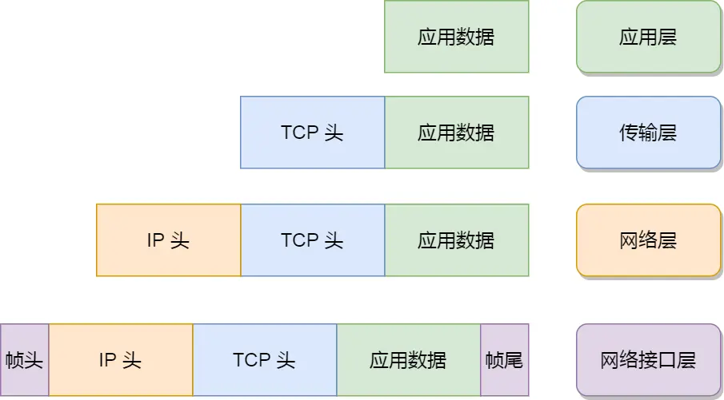
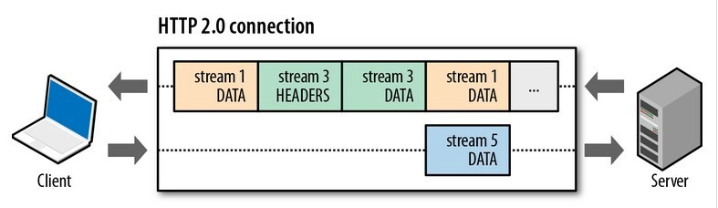

# TCP/IP网络模型



网络接口层的传输单位是帧（frame），IP 层的传输单位是包（packet），TCP 层的传输单位是段（segment），HTTP 的传输单位则是消息或报文（message）。但这些名词并没有什么本质的区分，可以统称为数据包。

# 一. HTTP

## 1. HTTP常见错误码


`1xx`：错误码属于提示信息，是协议处理中的一种中间状态，实际用到的不多

`2xx`：服务器成功处理了客户端请求

- 「**200 OK**」 成功，一切正常
- 「**204 No Content**」 成功，但响应头没有body数据
- 「**206 Partial Content**」成功，应用于HTTP分块下载或者断点续传，表示成功的接收了一部分资源，并不是全部

`3xx`：重定向

- 「**301 Moved Permanently**」永久重定向，表示请求得到资源已经不存在了，需要用新的URL访问
- 「**302 Found**」临时重定向，请求的资源还在，但暂时需要另一个URL来访问

301和302都会在响应头的`Location`指明后续要跳转的URL，浏览器会自动指向新的URL

- 「**304 Not Modified**」不跳转，表示资源未修改，且资源已缓存，告诉客户端可使用缓存资源

`4xx`：客户端报文有误

- 「**400 Bad Request**」表示客户端请求的报文有错误，但只是个笼统的错误。
- 「**403 Forbidden**」服务器禁止访问资源，并不是客户端请求出错
- 「**404 Not Found**」表示请求的资源在服务器上不存在或未找到，所以无法提供给客户端。

`5xx` 类状态码表示客户端请求报文正确，但是**服务器处理时内部发生了错误**，属于服务器端的错误码。

- 「**500 Internal Server Error**」表示服务器发生错误，但只是个笼统的错误
- 「**501 Not Implemented**」表示客户端请求的功能还不支持，类似“即将开业，敬请期待”的意思。
- 「**502 Bad Gateway**」通常是服务器作为网关或代理时返回的错误码，表示服务器自身工作正常，访问后端服务器发生了错误。
- 「**503 Service Unavailable**」表示服务器当前很忙，暂时无法响应客户端，类似“网络服务正忙，请稍后重试”的意思。

## 2. HTTP长链接

`Connection` 字段最常用于客户端要求服务器使用「HTTP 长连接」机制，以便其他请求复用。


HTTP 长连接的特点是，只要任意一端没有明确提出断开连接，则保持 TCP 连接状态。

HTTP/1.1 版本的默认连接都是长连接，但为了兼容老版本的 HTTP，需要指定 `Connection` 首部字段的值为 `Keep-Alive`。

```
Connection: Keep-Alive
```

开启了 HTTP Keep-Alive 机制后， 连接就不会中断，而是保持连接。当客户端发送另一个请求时，它会使用同一个连接，一直持续到客户端或服务器端提出断开连接。 

## 3. HTTP协议

HTTP 最突出的优点是「简单、灵活和易于扩展、应用广泛和跨平台」。

1. 简单

   HTTP 基本的报文格式就是 `header + body`，头部信息也是 `key-value` 简单文本的形式,易于理解

2. 灵活和易于扩展

   HTTP 协议里的各类请求方法、URI/URL、状态码、头字段等每个组成要求都没有被固定死，都允许开发人员**自定义和扩充**。

   同时 HTTP 由于是工作在应用层（ `OSI` 第七层），则它**下层可以随意变化**，比如：

   - HTTPS 就是在 HTTP 与 TCP 层之间增加了 SSL/TLS 安全传输层；
   - HTTP/1.1 和 HTTP/2.0 传输协议使用的是 TCP 协议，而到了 HTTP/3.0 传输协议改用了 UDP 协议。

3. 应用广泛和跨平台

   互联网发展至今，HTTP 的应用范围非常的广泛，从台式机的浏览器到手机上的各种 APP，从看新闻、刷贴吧到购物、理财、吃鸡，HTTP 的应用遍地开花，同时天然具有**跨平台**的优越性。

### 1. HTTP/1.1的优缺点

HTTP 协议里有优缺点一体的**双刃剑**，分别是「无状态、明文传输」，同时还有一大缺点「不安全」。

1. 无状态优缺点

   - 优点：

     因为服务器不会去记忆 HTTP 的状态，所以不需要额外的资源来记录状态信息，这能减轻服务器的负担，能够把更多的 CPU 和内存用来对外提供服务。

   - 缺点：

     例如登录->添加购物车->下单->结算->支付，这系列操作都要知道用户的身份才行。但服务器不知道这些请求是有关联的，每次都要问一遍身份信息。

     对于无状态的问题，解法方案有很多种，其中比较简单的方式是用 **Cookie** 技术。

     `Cookie` 通过在请求和响应报文中写入 Cookie 信息来控制客户端的状态。

   

2. 明文传输双刃剑

   明文意味着在传输过程中的信息，是可方便阅读的，比如 Wireshark 抓包都可以直接肉眼查看，为我们调试工作带了极大的便利性。

   但是这正是这样，信息的内容都毫无隐私可言，很容易就能被窃取

3. 不安全

   - 通信使用明文（不加密），内容可能会被窃听。比如，**账号信息容易泄漏。**
   - 不验证通信方的身份，因此有可能遭遇伪装。比如，**访问假的淘宝、拼多多。**
   - 无法证明报文的完整性，所以有可能已遭篡改。比如，**网页上植入垃圾广告，视觉污染。**

   HTTP 的安全问题，可以用 HTTPS 的方式解决，也就是通过引入 SSL/TLS 层，使得在安全上达到了极致。

### 2. 相比于HTTP/1.0，HTTP/1.1有哪些改进的点？

HTTP 协议是基于 **TCP/IP**，并且使用了「**请求 - 应答**」的通信模式，所以性能的关键就在这**两点**里。

1. 长连接

   早期 HTTP/1.0 每发起一个请求，都要新建一次 TCP 连接（三次握手），而且是串行请求，做了无谓的 TCP 连接建立和断开，增加了通信开销。

   HTTP/1.1 提出了**长连接**的通信方式。减少了 TCP 连接的重复建立和断开所造成的额外开销，减轻了服务器端的负载。

   **长连接**的特点是，只要任意一端没有明确提出断开连接，则保持 TCP 连接状态。


​	当然，如果某个 HTTP 长连接超过一定时间没有任何数据交互，服务端就会主动断开这个连接。

2. 管道网络传输

   HTTP/1.1 采用了长连接的方式，这使得管道（pipeline）网络传输成为了可能。

   即可在同一个 TCP 连接里面，客户端可以发起多个请求，只要第一个请求发出去了，不必等其回来，就可以发第二个请求出去，可以**减少整体的响应时间。**

   举例来说，客户端需要请求两个资源。以前的做法是，在同一个 TCP 连接里面，先发送 A 请求，然后等待服务器做出回应，收到后再发出 B 请求。那么，管道机制则是允许浏览器同时发出 A 请求和 B 请求，如下图：


​		但是**服务器必须按照接收请求的顺序发送对这些管道化请求的响应**。

​		如果服务端在处理 A 请求时耗时比较长，那么后续的请求的处理都会被阻塞住，这称为「队头堵塞」。

​	所以，**HTTP/1.1 管道解决了请求的队头阻塞，但是没有解决响应的队头阻塞**。

3. 队头阻塞

   「请求 - 应答」的模式会造成 HTTP 的性能问题。为什么呢？

   因为当顺序发送的请求序列中的一个请求因为某种原因被阻塞时，在后面排队的所有请求也一同被阻塞了，会招致客户端一直请求不到数据，这也就是「**队头阻塞**」，好比上班的路上塞车。


### 3. HTTP/1.1的不足：

- 请求 / 响应头部（Header）未经压缩就发送，首部信息越多延迟越大。只能压缩 `Body` 的部分；
- 发送冗长的首部。每次互相发送相同的首部造成的浪费较多；
- 服务器是按请求的顺序响应的，如果服务器响应慢，会招致客户端一直请求不到数据，也就是队头阻塞；
- 没有请求优先级控制；
- 请求只能从客户端开始，服务器只能被动响应。

### 4. HTTP 与 HTTPS 有哪些区别？

- HTTP 是超文本传输协议，信息是明文传输，存在安全风险的问题。HTTPS 则解决 HTTP 不安全的缺陷，在 TCP 和 HTTP 网络层之间加入了 SSL/TLS 安全协议，使得报文能够加密传输。
- HTTP 连接建立相对简单， TCP 三次握手之后便可进行 HTTP 的报文传输。而 HTTPS 在 TCP 三次握手之后，还需进行 SSL/TLS 的握手过程，才可进入加密报文传输。
- 两者的默认端口不一样，HTTP 默认端口号是 80，HTTPS 默认端口号是 443。
- HTTPS 协议需要向 CA（证书权威机构）申请数字证书，来保证服务器的身份是可信的。

### 5. HTTP/2 做了什么优化？

HTTP/2 协议是基于 HTTPS 的，所以 HTTP/2 的安全性也是有保障的。


那 HTTP/2 相比 HTTP/1.1 性能上的改进：

1. 头部压缩

   HTTP/2 会**压缩头**（Header）如果你同时发出多个请求，他们的头是一样的或是相似的，那么，协议会帮你**消除重复的部分**。

   这就是所谓的 `HPACK` 算法：在客户端和服务器同时维护一张头信息表，所有字段都会存入这个表，生成一个索引号，以后就不发送同样字段了，只发送索引号，这样就**提高速度**了。

2. 二进制格式

   HTTP/2 不再像 HTTP/1.1 里的纯文本形式的报文，而是全面采用了**二进制格式**，头信息和数据体都是二进制，并且统称为帧（frame）：**头信息帧（Headers Frame）和数据帧（Data Frame）**。

3. 并发传输

   HTTP/1.1 的实现是基于请求-响应模型的。同一个连接中，HTTP 完成一个事务（请求与响应），才能处理下一个事务，如果响应迟迟不来，那么后续的请求是无法发送的，也造成了**队头阻塞**的问题。

   而 HTTP/2 就引出了 Stream 概念，多个 Stream 复用在一条 TCP 连接。

   

   从上图可以看到，1 个 TCP 连接包含多个 Stream，Stream 里可以包含 多个 Message。Message 里包含一条或者多个 Frame，Frame 是 HTTP/2 最小单位，以二进制压缩格式存放 HTTP/1 中的内容（头部和包体）。

   **针对不同的 HTTP 请求用独一无二的 Stream ID 来区分，接收端可以通过 Stream ID 有序组装成  HTTP 消息，不同 Stream 的帧是可以乱序发送的，因此可以并发不同的 Stream ，也就是 HTTP/2 可以并行交错地发送请求和响应**。

   比如下图，服务端**并行交错地**发送了两个响应： Stream 1 和 Stream 3，这两个 Stream 都是跑在一个 TCP 连接上，客户端收到后，会根据相同的 Stream ID 有序组装成 HTTP 消息。

   

4. 服务器推送

   HTTP/2 还在一定程度上改善了传统的「请求 - 应答」工作模式，服务端不再是被动地响应，可以**主动**向客户端发送消息。

   客户端和服务器**双方都可以建立 Stream**， Stream ID 也是有区别的，客户端建立的 Stream 必须是奇数号，而服务器建立的 Stream 必须是偶数号。

   比如下图，Stream 1 是客户端向服务端请求的资源，属于客户端建立的 Stream，所以该 Stream 的 ID 是奇数（数字  1）；Stream 2 和 4 都是服务端主动向客户端推送的资源，属于服务端建立的 Stream，所以这两个 Stream 的 ID  是偶数（数字 2 和 4）。


再比如，客户端通过 HTTP/1.1 请求从服务器那获取到了 HTML 文件，而 HTML 可能还需要依赖 CSS 来渲染页面，这时客户端还要再发起获取 CSS 文件的请求，需要两次消息往返，如下图左边部分：


如上图右边部分，在 HTTP/2 中，客户端在访问 HTML 时，服务器可以直接主动推送 CSS 文件，减少了消息传递的次数。

> HTTP/2 有什么缺陷？

HTTP/2 通过 Stream 的并发能力，解决了 HTTP/1 队头阻塞的问题，看似很完美了，但是 HTTP/2 还是存在“队头阻塞”的问题，只不过问题不是在 HTTP 这一层面，而是在 TCP 这一层。

**HTTP/2 是基于 TCP 协议来传输数据的，TCP 是字节流协议，TCP  层必须保证收到的字节数据是完整且连续的，这样内核才会将缓冲区里的数据返回给 HTTP 应用，那么当「前 1  个字节数据」没有到达时，后收到的字节数据只能存放在内核缓冲区里，只有等到这 1 个字节数据到达时，HTTP/2  应用层才能从内核中拿到数据，这就是 HTTP/2 队头阻塞问题。**


举个例子，如下图：


图中发送方发送了很多个 packet，每个 packet 都有自己的序号，你可以认为是 TCP 的序列号，其中 packet 3  在网络中丢失了，即使 packet 4-6 被接收方收到后，由于内核中的 TCP  数据不是连续的，于是接收方的应用层就无法从内核中读取到，只有等到 packet 3 重传后，接收方的应用层才可以从内核中读取到数据，这就是  HTTP/2 的队头阻塞问题，是在 TCP 层面发生的。

所以，一旦发生了丢包现象，就会触发 TCP 的重传机制，这样在一个 TCP 连接中的**所有的 HTTP 请求都必须等待这个丢了的包被重传回来**。

### 6. HTTP/3 做了哪些优化？

HTTP/1.1 和 HTTP/2 都有队头阻塞的问题：

- HTTP/1.1 中的管道（ pipeline）虽然解决了请求的队头阻塞，但是**没有解决响应的队头阻塞**，因为服务端需要按顺序响应收到的请求，如果服务端处理某个请求消耗的时间比较长，那么只能等响应完这个请求后， 才能处理下一个请求，这属于 HTTP 层队头阻塞。
- HTTP/2 虽然通过多个请求复用一个 TCP 连接解决了 HTTP 的队头阻塞 ，但是**一旦发生丢包，就会阻塞住所有的 HTTP 请求**，这属于 TCP 层队头阻塞。

HTTP/2 队头阻塞的问题是因为 TCP，所以 **HTTP/3 把 HTTP 下层的 TCP 协议改成了 UDP！**


UDP 发送是不管顺序，也不管丢包的，所以不会出现像 HTTP/2 队头阻塞的问题。大家都知道 UDP 是不可靠传输的，但基于 UDP 的 **QUIC 协议** 可以实现类似 TCP 的可靠性传输。

**QUIC 有以下 3 个特点**。

1. 队头阻塞：

   QUIC 协议也有类似 HTTP/2 Stream 与多路复用的概念，也是可以在同一条连接上并发传输多个 Stream，Stream 可以认为就是一条 HTTP 请求。

   QUIC 有自己的一套机制可以保证传输的可靠性的。**QUIC 连接上的多个 Stream 之间并没有依赖，当某个流发生丢包时，只会阻塞这个流，其他流不会受到影响，因此不存在队头阻塞问题**。

   

2. 更快的连接建立

   对于 HTTP/1 和 HTTP/2 协议，TCP 和 TLS 是分层的，分别属于内核实现的传输层、openssl 库实现的表示层，因此它们难以合并在一起，需要分批次来握手，先 TCP 握手，再 TLS 握手。

   QUIC 内部包含了 TLS，它在自己的帧会携带 TLS 里的“记录”，再加上 QUIC 使用的是 TLS/1.3，因此仅需 1 个 RTT 就可以「同时」完成建立连接与密钥协商

   甚至，在第二次连接的时候，应用数据包可以和 QUIC 握手信息（连接信息 + TLS 信息）一起发送，达到 0-RTT 的效果。

3. 连接迁移

   基于 TCP 传输协议的 HTTP 协议，由于是通过四元组（源 IP、源端口、目的 IP、目的端口）确定一条 TCP 连接。

   

   那么**当移动设备的网络从 4G 切换到 WIFI 时，意味着 IP 地址变化了，那么就必须要断开连接，然后重新建立连接**。而建立连接的过程包含 TCP 三次握手和 TLS 四次握手的时延，以及 TCP 慢启动的减速过程，给用户的感觉就是网络突然卡顿了一下，因此连接的迁移成本是很高的。

   **而 QUIC 协议没有用四元组的方式来“绑定”连接，而是通过「连接 ID 」来标记通信的两个端点**，客户端和服务器可以各自选择一组 ID 来标记自己，因此即使移动设备的网络变化后，导致 IP 地址变化了，只要仍保有上下文信息（比如连接 ID、TLS 密钥等），就可以“无缝”地复用原连接，消除重连的成本，没有丝毫卡顿感，达到了**连接迁移**的功能。

   所以， QUIC 是一个在 UDP 之上的**伪** TCP + TLS + HTTP/2 的多路复用的协议。

   QUIC 是新协议，对于很多网络设备，根本不知道什么是 QUIC，只会当做 UDP，这样会出现新的问题，因为有的网络设备是会丢掉 UDP 包的，HTTP/3 现在普及的进度非常的缓慢，不知道未来 UDP 是否能够逆袭 TCP。 

# 常见问题

## 1. 键入网址到网页显示，期间发生了什么？


首先浏览器要先对URL进 行解析，从而生成发送给Web服务器的请求信息


DNS解析IP地址

在URL被解析时，先要通过DNS协议解析出IP地址


解析流程：

1. 客户端向本地DNS服务器查询缓存，请求IP地址
2. 本地DNS服务器向根域名服务器请求如何查询到IP地址
3. 根域名服务器返回本地服务器顶级域名服务器的地址
4. 顶级域名服务器返回本地DNS服务器权威域名服务器的地址
5. 权威域名服务器返回本地DNS服务器目标地址的IP地址
6. 本地DNS服务器返回客户端要访问的IP地址

## 2. GET 与 POST

### 1. GET 和 POST 有什么区别？

- **GET 的语义是从服务器获取指定的资源**，这个资源可以是静态的文本、页面、图片视频等。GET 请求的参数位置一般是写在 URL 中，URL 规定只能支持 ASCII，所以 GET 请求的参数只允许 ASCII 字符 ，而且浏览器会对 URL 的长度有限制

- **POST 的语义是根据请求负荷（报文body）对指定的资源做出处理**，具体的处理方式视资源类型而不同。POST 请求携带数据的位置一般是写在报文 body 中，body 中的数据可以是任意格式的数据，只要客户端与服务端协商好即可，而且浏览器不会对 body 大小做限制。

### 2. GET 和 POST 方法都是安全和幂等的吗？

从 RFC 规范定义的语义说明下安全和幂等的概念：

- 在 HTTP 协议里，所谓的「安全」是指请求方法不会「破坏」服务器上的资源。
- 所谓的「幂等」，意思是多次执行相同的操作，结果都是「相同」的。

那么：

- **GET 方法就是安全且幂等的**，因为它是「只读」操作，无论操作多少次，服务器上的数据都是安全的，且每次的结果都是相同的。所以，**可以对 GET 请求的数据做缓存，这个缓存可以做到浏览器本身上（彻底避免浏览器发请求），也可以做到代理上（如nginx），而且在浏览器中 GET 请求可以保存为书签**。
- **POST** 因为是「新增或提交数据」的操作，会修改服务器上的资源，所以是**不安全**的，且多次提交数据就会创建多个资源，所以**不是幂等**的。所以，**浏览器一般不会缓存 POST 请求，也不能把 POST 请求保存为书签**。

但是实际过程中：

- 可以用 GET 方法实现新增或删除数据的请求，这样实现的 GET 方法自然就不是安全和幂等。
- 可以用 POST 方法实现查询数据的请求，这样实现的 POST 方法自然就是安全和幂等。

   你
