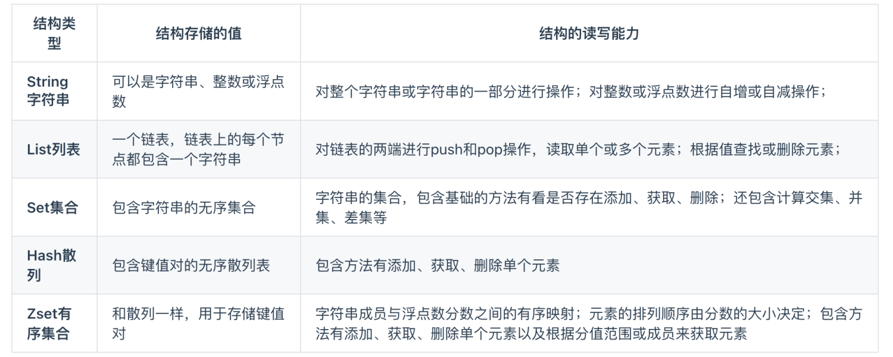
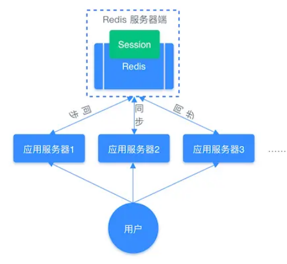
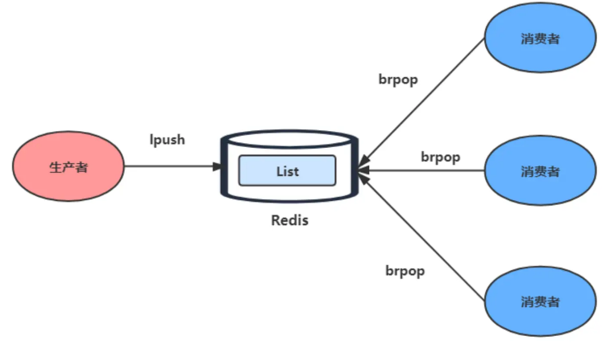
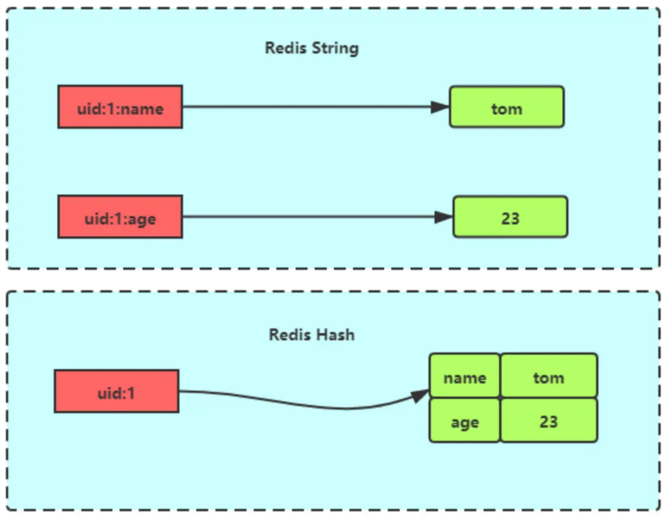
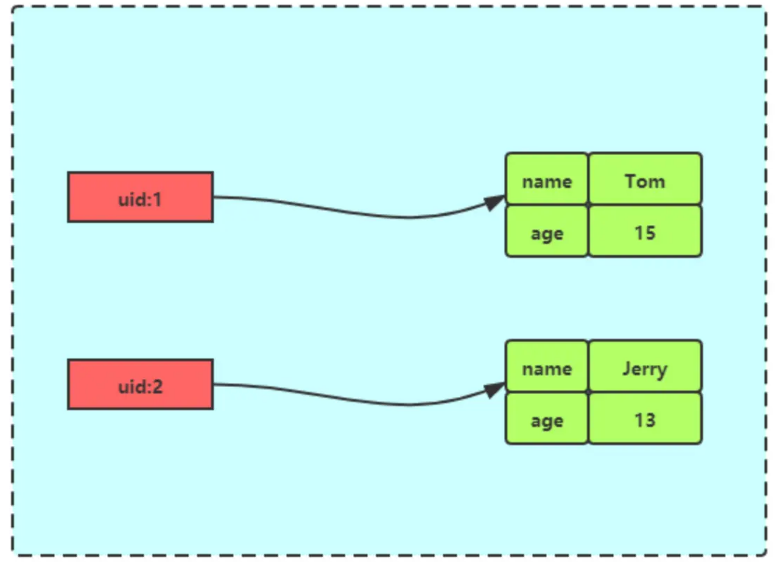
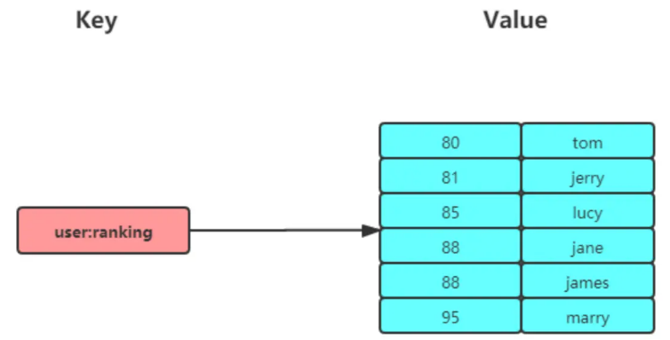

# 一、Redis 

redis是一种基于内存的数据库，对数据读写操作都是在内存中进行的，所以读写速度非常快

## 为何使用redis作为Mysql的缓存

1. redis具备高性能

   假如用户第一次访问Mysql中的某些数据，这个过程会比较慢，因为是从硬盘中读取的，将改用户访问的数据缓存到Redis中，这样下次访问就可以从Redis缓存中直接拿

2. redis具备高并发

   单台设备的Redis的QPS是Mysql的10倍，redis单机的QPS能够轻松过10万，而Mysql的单机QPS很难过1万

# 二、Redis常用的数据类型



常见应用场景

- String

  缓存对象、常规计数、分布式锁、共享Session

- List

  消息队列（但有两个问题1.生产者需要自行实现全局唯一ID；2.不能以消费组形式消费数据）

- Hash

  缓存对象、购物车

- Set

  聚合计算（交集并集差集），比如点赞、共同关注、抽奖活动等

- Zset

  排序场景，比如排行榜、粉丝列表、关注列表


## 1.string

### 底层结构

底层结构是**SDS（简单动态字符串）**，相比于C语言原生字符串

- SDS不仅可以保存文本，还可以保存二进制数据，比如图片、视频、声音等
- SDS获取字符串长度的时间复杂度是O(1)，因为SDS结构里有len属性去记录字符串长度
- SDS在拼接字符串时会检查SDS空间是否满足要求，如果不够会自动扩容，所以拼接字符串不会造成缓冲区溢出问题

### 应用场景

1. 缓存对象

   直接存储整个对象JSON等

2. 常规计数

   因为Redis是单线程的，所以执行命令的过程是原子的，因此string数据类型适合计数场景，比如计算访问次数、点赞、转发、库存数量等

3. 分布式锁

   使用set命令中的的NX参数实现分布式锁

   - key不存在，显示插入成功，可以用来表示加锁成功
   - key存在，则会显示插入失败，可以用来表示加锁失败

   ```
   set lock_key unique_value NX PX 10000
   ```

   - lock_key就是key键
   - unique_value是客户端生成的唯一的标识
   - NX代表只在lock_key不存在，才对lock_key进行设置操作
   - PX 10000标识设置lock_key的过期时间为10s，这是为了避免客户端发生异常而无法释放锁

   而解锁的过程就是将lock_key键删除，但不能乱删，要保证执行操作的客户端就是加锁的客户端，所以解锁时要判断锁的unique_value是否为加锁客户端，是的话，才将lock_key键删除。

   那么解锁是有两步操作，这时就需要lua脚本来保证解锁的原子性，因为Redis在执行Lua脚本时，可以以原子性的方式执行，保证了锁释放操作的原子性

   ```go
   // 释放锁时，先比较 unique_value 是否相等，避免锁的误释放
   if redis.call("get",KEYS[1]) == ARGV[1] then
       return redis.call("del",KEYS[1])
   else
       return 0
   end
   ```

4. 共享session信息

   通常我们在开发后台管理系统时，会使用session来保存用户的会话登陆状态， 我们借助Redis对所有服务的session信息进行统一的存储于管理，因此无论请求发送到哪台服务器，服务器都会去同一个Redis获取相关的session信息，这样就解决了分布式系统下Session存储的问题

   

## 2.list

List是一个简单的字符串列表，按照插入顺序排序，可以从头部或尾部向LIst列中添加元素

列表的最大长度为2^32-1,也就是每个列表支持超过40亿个元素

### 底层实现

List类型的底层数据结构是**压缩列表或双向链表**

- 当元素个数小于512个，所有值小于64字节的话，Redis使用压缩链表作为List的底层结构
- 如果不满足以上条件，会使用双向链表作为List的底层结构

**但在Redis3.2版本之后，List数据类型的底层结构就只由quicklist实现了，替代了双向链表和压缩链表**

```
quicklist本质上就是对ziplist的封装，本质上是一个双向链表，但链表的节点是quicklistnode。每个quicklistnode上存储的是ziplist
```

### 应用场景

1. 消息队列

   消息队列在存储消息时，需满足3个条件，分别是**消息保证顺序**，**处理重复的消息**，**保证消息的可靠性**

   1. 保证消息顺序（使用 LPUSH + BRPOP）

      因为List本身就有先进先出的特性，所以使用`LPUSH`和`RPOP`就可以实现纤细队列，但是有个风险是，我们的`RPOP`是循环取消息，如果消息队列内消息为空，`RPOP`还是在不断循环，造成不必要的性能损失，所以`Redis`提供了`BRPOP`命令

      ```
      BRPOP命令也被称为阻塞式读取，客户端在没有读取到队列数据时，自动阻塞，知道有新的数据写入消息队列，再开始读取新数据，这样消费者就不用不停调用RPOP增加CPU开销了
      ```

      

   2. 如何处理重复消费（生产者自行实现全局唯一 ID）

      - 每个消息需要一个全局ID
      - 消费者要记录已经处理过的消息ID，当收到一条消息后，消费者程序就可以对比收到的消息ID和记录的

   3. 如何保证消息可靠性（使用 BRPOPLPUSH）

      当消费者从List中读取一条消息后，List就不会再留存这条消息了，所以如果消费者程序在处理消息的过程中出现了故障或宕机，就会导致消息丢失

      - 使用`BRPOPLPUSH`，这个命令可以让消费者从一个List中读取消息的同时，Redis就会把这个消息再插入到另一个List(可以叫做备份List)留存

2. 弊端

   List不支持多个消费者消费同一条消息，因为一旦消息被一个消费者取出，这条消息就会被消息队列删除，如果要实现一个消息被多个消费者消费，那么就要将多个消费者组成一个消费组，使得多个消费者能消费同一条消息，但List类型并不支持消费组

## 3.hash

hash是由一个键值对(key-value)集合，所以Hash特别适合用于存储对象

string和hash对比



### 底层实现

Hash类型由**压缩链表或哈希表**

- 当元素个数小于512个，所有值小于64字节的话，Redis使用压缩链表作为List的底层结构
- 如果不满足上面条件，Redis会使用哈希表作为hash类型的底层数据结构

**但在Redis7.0版本之后，压缩列表数据结构已经废弃了，交由 listpack 数据结构来实现了**

### 应用场景

1. 缓存对象

   Hash类型适合存储对象，比如用户信息等

   

2. 购物车

## 4.Set

Set是一个有序但不允许重复的键值集合，它的存储顺序不会被按照插入的先后顺序进行存储

### 底层实现

Set底层是由**整数集合或哈希表**

- 当元素个数小于512个，所有值小于64字节的话，Redis使用整数集合作为Set的底层结构
- 如果不满足上面条件，则Redis使用哈希表作为Set类型的底层数据结构

### 应用场景

集合的主要特性有：无序、不可重复、支持并集、交集、差集等操作

因此Set适合用来做数据去重和保障数据的唯一性，还可以用来统计多个集合的交集、错集和并集，当我们存储的数据是无序且需要去重的情况下，比较适合使用集合类型来进行存储

但Set 的差、并、交集的计算复杂度高，在数据量较大的情况下，如果直接执行这些计算，会导致Redis实例阻塞，为避免风险出现，可以选择一个从库完成聚合统计，或者把数据返回给客户端，由客户端来完成聚合统计

1. 点赞

   Set类型保证一个用户只能点一个赞

2. 共同关注

   Set类型支持交集运算，所以可以用来计算共同关注的好友、公众号等

3. 抽奖活动

   存储某活动中中奖的用户名，Set类型因为有去重功能，可以保证同一个用户不会中奖两次

## 5.ZSet

Zset类型(有序集合类型)相比于Set类型多了一个排序属性score(分值)，对于有序集合Zset来说，每个存储元素相当于两个值组成的，**一个是有序集合的元素值，一个是值排序**

有序集合保留集合不能有重复元素的特性，但不同的是有序集合中的元素可以排序



### 底层实现

Zset底层数据结构是由**压缩列表或跳表**

- 当元素个数小于512个，所有值小于64字节的话，Redis使用**压缩列表**
- 如果不满足上面条件，则Redis使用跳表作为Set类型的底层数据结构

**在 Redis 7.0 中，压缩列表数据结构已经废弃了，交由 listpack 数据结构来实现了。**

### 应用场景

Zset类型可以根据元素的权重来排序，我们可以自己来决定每个元素的权重值，比如说，我们可以根据元素插入`Sorted Set`的时间确定权重值，先插入的元素权重小，后插入的元素权重大。

在面对需要展示最新列表、排行榜等场景时，如果数更新频繁或者需要分页显示，可以优先考虑使用`Sorted Set`

1. 排行榜

   有序集合比较经典的适用场景就是排行榜，比如学生成绩排名榜，视频播放榜等

2. 电话姓名排序

   使用有序集合的 `ZRANGEBYLEX` 或 `ZREVRANGEBYLEX` 可以帮助我们实现电话号码或姓名的排序，我们以 `ZRANGEBYLEX` （返回指定成员区间内的成员，按 key 正序排列，分数必须相同）
