# Redis数据结构

Redis数据结构并不是指String、List、Hash、Zset、Set这种，因为这些是Redis键值对中值得数据类型，也就是数据的保存形式，这些底层实现的方式就用到了数据结构。


Redis新旧版本的底层数据结构不尽相同，包括有SDS、双向链表、压缩列表、哈希表、跳表、整数集合、quicklist、listpack等。


## SDS

Redis是使用C语言实现的，但是没有直接使用`char *`来构建字符串，而是自己封装了SDS(简单动态字符串)

### 1. C语言字符串的缺陷

C语言中`char *`字符数组的最后一位是`'\0'`，因为在C语言中char *指针指向的是字符串的起始地址，而字符串的结尾用'\0'表示，意思是字符串的结束，下面是获取strlen函数的流程


- **时间复杂度为O(n)，此处可改进**
- **除此之外，字符串中不能夹着'\0'不然会被误认为是字符串结尾，这使得C语言的字符串只能保存文本数据，不能保存图片、视频、音频等二进制数据**
- **C语言字符串是不会记录自身缓冲区大小的，在strcat函数假定程序员在执行这个函数时，已经为dest分配了足够多的内存，可以容纳src字符串中的所有内容，一旦这个假定不成立，就会发生缓冲区溢出造成程序运行终止**

### 2. SDS结构设计


- **Len：记录了字符串长度**。这样获取字符串长度的时候，只需要返回这个成员变量值就行，时间复杂度只需要O(1)
- **alloc：分配给字符数组的空间长度**。这样在修改字符串的时候，可以通过`alloc-len`计算出剩余得到空间大小，可以判断空间是否满足修改需求，如果不满足的话，就会自动将SDS的空间拓展至执行修改所需的大小，然后才执行实际的修改操作，所以使用SDS既不需要手动修改SDS的空间大小，也不会出现缓冲区溢出的问题
- **flags：用来表示不同类型的SDS**。一共设计了5中类型，分别是sdshdr5，sdshdr8,sdshdr16,sdshdr32,sdshdr64，后面再说明区别之处
- **Buf[]：字符数组，用来保存实际数据**。不仅可以保存字符串，也可以保存二进制数据

总的来说，Redis的SDS结构在原本字符串数组之上，增加了三个元数据：len、alloc、flags，用来解决C语言字符串的缺陷问题

1. O(1)时间复杂度获取字符串长度

   Redis的SDS结构因为加入**len成员变量**，那么获取字符串长度的是时候，直接返回这个成员变量的值就行，复杂度就只有O(1)

2. 二进制安全

   **SDS不再需要'\0'字符标识字符串结尾了**，而是有个专门的len成员变量记录长度，**SDS的API都是以处理二进制的方式来处理SDS存放在buf[]里的数据，程序不会对其中的数据做任何限制**，所以Redis不仅可以保存文本数据，也可以保存任何形式的二进制数据

3. 不会发生缓冲区溢出

   C语言的字符串标准库提供的字符串操作函数，大多数都是不安全的。Redis的SDS结构里引入了alloc和len成员变量，这样SDS  API通过alloc-len计算，可以计算出剩余的大小，这样在对字符串进行修改操作的时候，如果缓冲区大小不够用，Redis就会自动扩大SDS的空间大小**【新的总长 = 当前sds长度 + 需要扩容的长度】**

   - 如果所需的sds长度小于1MB，那么最后的扩容是按照翻倍扩容来执行的，即两倍newlen
   - 如果所需的sds长度大于1MB，那么最后的扩容长度是newlen+1MB

4. 节省内存空间

   SDS中的flag成员变量，表示的是SDS类型

   Redis一共设计了5中类型，包括sdshdr5、sdshdr8、sdshdr16、sdshdr32 和 sdshdr64。主要区别在于，它们数据结构中的len和alloc成员变量的数据类型不同

   - **SDS 设计不同类型的结构体，是为了能灵活保存不同大小的字符串，从而有效节省内存空间**
   - 在 struct 声明了 `__attribute__ ((packed))` ，它的作用是：**告诉编译器取消结构体在编译过程中的优化对齐，按照实际占用字节数进行对齐**。

   

   

## 链表

C语言本身没有链表这个结构，Redis自己设计了一个，有前置节点和后置节点，**这个是一个双向链表**。

普通的链表节点：

```
typedef struct listNode {
    //前置节点
    struct listNode *prev;
    //后置节点
    struct listNode *next;
    //节点的值
    void *value;
} listNode;
```


### 1. Redis所自定义的ListNode结构体

```
typedef struct list {
    //链表头节点
    listNode *head;
    //链表尾节点
    listNode *tail;
    //节点值复制函数
    void *(*dup)(void *ptr);
    //节点值释放函数
    void (*free)(void *ptr);
    //节点值比较函数
    int (*match)(void *ptr, void *key);
    //链表节点数量
    unsigned long len;
} list;
```

List结构为链表提供了链表头指针head、链表尾节点tail、链表节点数量len、以及可以自定义的dup、free、match函数。


### 2. 链表的优缺点

Redis链表的优点：

1. listNode链表节点的结构体带有Prev和next指针，**获取某个节点的前置节点或后置节点的时间复杂度只需O(1)**，而且这两个指针都可以指向NULL，所以链表是无环链表
2. list结构因为提供了头指针head和尾结点tail，所以**获取链表中的节点数量的时间复杂度只需O(1)**
3. list结构因为提供了链表节点数量len，所以**获取链表中的节点数量的时间复杂度只需O(1)**
4. listNode链表节点使用void*指针保存节点值，并且可以通过list结构的dup、free、match函数指针为节点设置该节点类型特定的函数，因此**链表节点可以保存不同类型的值**

链表的缺陷：

1. 链表每个节点之间的内存都是不连续的，意味着无法很好利用CPU缓存
2. 保存一个链表节点的值都需要一个链表节点结构头的分配，内存开销较大

在Redis3.0的list对象在数据量较少的情况下，会采用**压缩列表**作为其底层结构，优点是节省内存空间， 并且是内存紧凑型的数据结构。但是压缩列表存在性能问题，所以在Redis 3.2版本将List底层数据结构改为**quicklist**实现

## 压缩列表

压缩列表的最大特点，就是他是一种内存紧凑型的数据结构，占用一块连续的内存空间，不仅可以利用CPU缓存，而且会根据不同的长度进行编码，这种方法可以有效的节省内存开销

### 1. 压缩列表的数据结构

压缩列表时是Redis为了节约内存而开发的，它是由连续内存组成的顺序型数据结构，有点类似数组

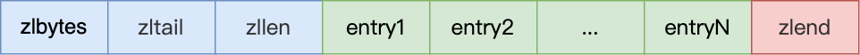

压缩列表在表头有三个字段：

- zlbytes：记录整个压缩列表**占用字节数**
- zltail：记录压缩列表**尾部节点距离起始地址**多少字节，也就是尾列表的偏移量
- zllen：记录压缩列表包含的**节点数量**
- zlend：标记压缩列表的结束点，固定值0xFF(十进制255)

### 2. 压缩列表的缺陷

1. 不能保存过多的元素， 否则查询效率会很低
2. 新增修改元素时，压缩列表的内存空间需要重新分配，甚至可能引发连锁更新问题

因此，redis对象包含的元素数量较少，或者元素值不大的情况下才会使用压缩列表作为底层数据结构。

## 哈希表

哈希表中每一个key都是独一无二的，程序可以根据key查找到与之关联的value，进行修改或删除等，哈希的优点是查询数据的时间复杂度为O(1)，当时在哈希表大小固定的情况下，随着数据不断增多，那么哈希冲突的可能性也会越高。Redis采用**链式哈希**来解决哈希冲突。

### 1. 哈希表结构设计

```
typedef struct dictht {
    //哈希表数组
    dictEntry **table;
    //哈希表大小
    unsigned long size;  
    //哈希表大小掩码，用于计算索引值
    unsigned long sizemask;
    //该哈希表已有的节点数量
    unsigned long used;
} dictht;
```

可以看到，哈希表是一个数组(dictEntry **Table)，数组的每个元素是一个指向[哈希表节点(dictEntry)]的指针

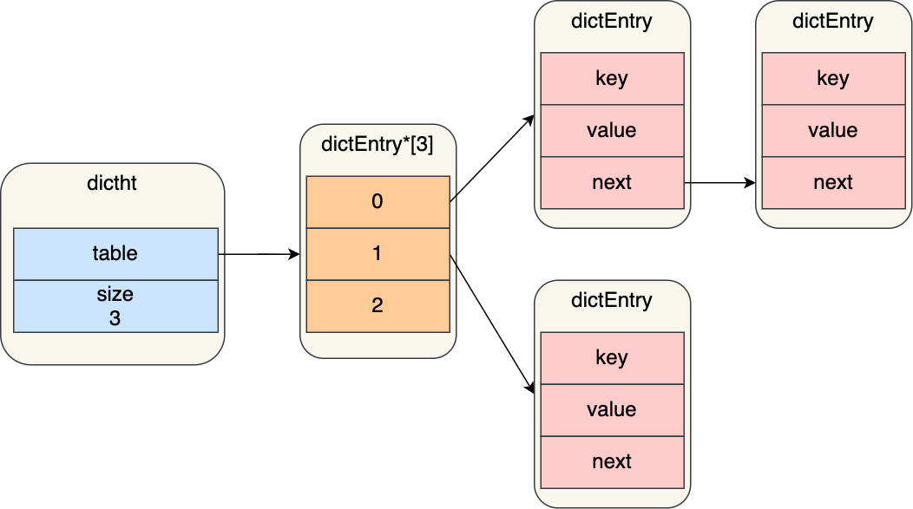

哈希表节点的结构如下：

```
typedef struct dictEntry {
    //键值对中的键
    void *key;
  
    //键值对中的值
    union {
        void *val;
        uint64_t u64;
        int64_t s64;
        double d;
    } v;
    //指向下一个哈希表节点，形成链表
    struct dictEntry *next;
} dictEntry;
```

dictEntry结构里不仅包含指向键和值的指针，还包含了指向下一个哈希表的指针，这个指针可以将多个哈希值相同的键值对链接起来，以此来解决哈希冲突的问题，这就是链式哈希。

### 2. 哈希冲突

哈希表实际上是一个数组，数组的每一个元素就是一个哈希桶

当一个键值对的键经过Hash函数计算后得到的哈希值，再将(哈希值%哈希表的大小)取模计算，得到的结果值就是该key-value对应的数组元素位置，也就是第几个哈希桶

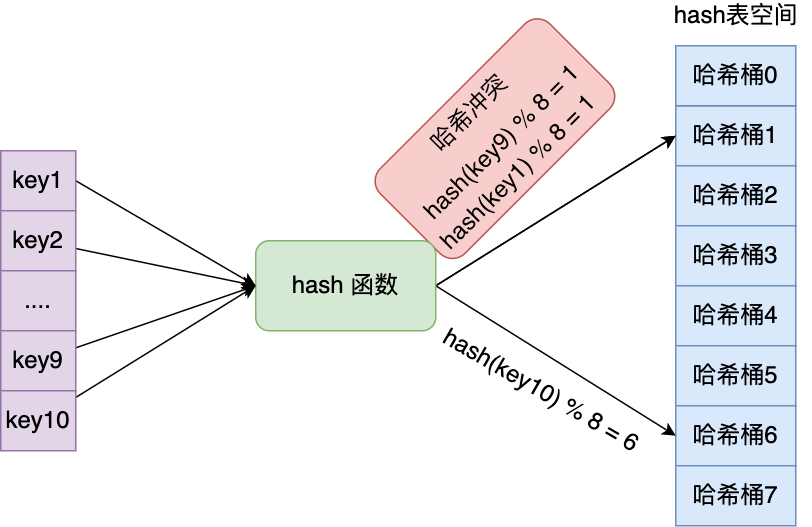

因此key1和key9对应到了相同的哈希桶中，这就发生了哈希冲突

**当有两个以上的数量的key被分配到了哈希表中同一个哈希桶上时，就表示发生了哈希冲突**

#### 1. 链式哈希

每个hash节点都有一个next指针，用于指向像一个哈希表节点，因此多个哈希表可以用next指针构成一个单向链表，**被分配到同一个哈希桶上的多个节点可以用这个单向链表连接起来**，这样就解决了哈希冲突

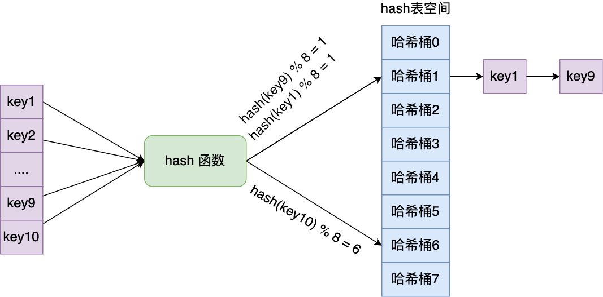

不过，链式哈希的局限性也很明显，随着链表长度增加，查询这一位置的数据的耗时就会增加，毕竟查询的时间复杂度为O(n)，要想解决这一问题，就要进行rehash，也就是对哈希表的大小进行拓展。

#### 2. rehash

Redis使用dictht结构体表示哈希表，不过在使用哈希表时，Redis定义了一个dict结构体，这个结构体定义了**两个哈希表(ht[2])**

```
typedef struct dict {
    …
    //两个Hash表，交替使用，用于rehash操作
    dictht ht[2]; 
    …
} dict;
```

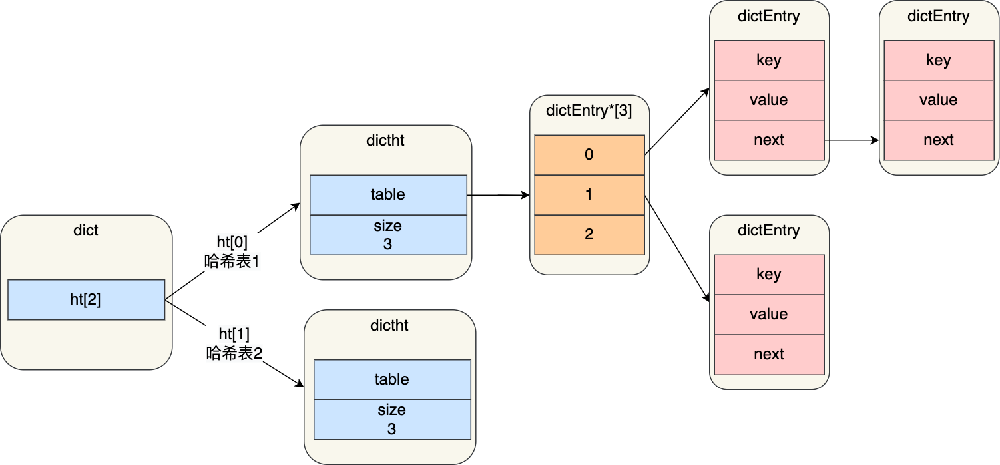

在正常服务请求阶段，插入的数据，都会写入到「哈希表 1」，此时的「哈希表 2」并没有被分配空间，随着数据增多，出发了rehash操作，这个过程分三步

- 给「哈希表 2」分配空间，一般会比「哈希表 1」大2倍
- 将「哈希表 1」的数据迁移到「哈希表 2」中
- 迁移完成后，「哈希表 1」的空间会被释放，并把「哈希表 2」设置为「哈希表 1」，然后在「哈希表 2」新创建一个空白的哈希表，为下次rehash做准备

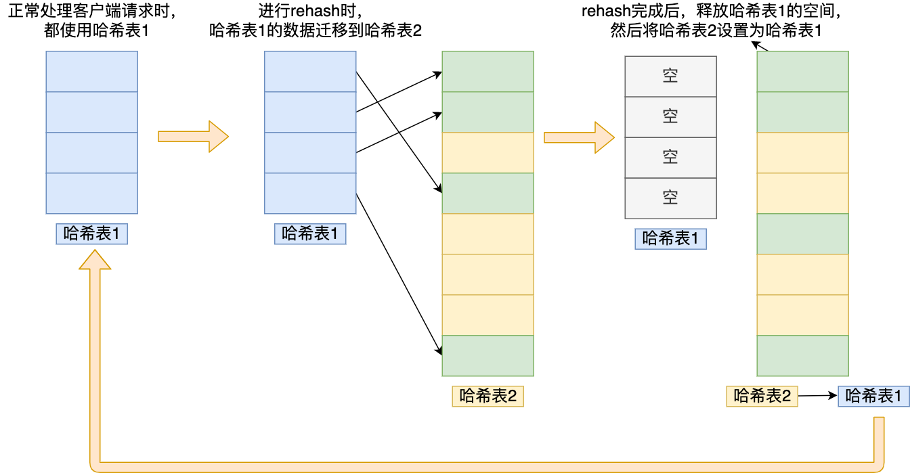

这个过程看起来很简单，但是其实第二步问题很大，如果「哈希表 1」的数据量非常大，那么在迁移至「哈希表 2 」的时候，因为会涉及大量的数据拷贝，此时可能会对Redis造成阻塞，无法服务其他请求

#### 3. 渐进式rehash

为了避免rehash在数据迁移过程中，因拷贝数据的耗时，影响Redis性能的情况，采用渐进式rehash，也就是数据的迁移工作不是一次性完成，而是分成多次了

步骤如下：

- 给哈希表2分配空间
- 在rehash期间，每次哈希表元素进行新增、删除、查找或者更新操作时，Redis除了会执行对应的操作之外，还会顺序将哈希表1中索引位置上所有的key-value转移到哈希表2上
- 随着处理客户端发起的哈希表操作请求数量越来越多，最终在某个时间点会把哈希表1的所有key-value迁移到哈希表2，从而完成rehash操作

在进行渐进式 rehash 的过程中，会有两个哈希表，所以在渐进式 rehash 进行期间，哈希表元素的删除、查找、更新等操作都会在这两个哈希表进行。

比如，查找一个 key 的值的话，先会在「哈希表 1」 里面进行查找，如果没找到，就会继续到哈希表 2 里面进行找到。

另外，在渐进式 rehash 进行期间，新增一个 key-value 时，会被保存到「哈希表 2 」里面，而「哈希表 1」  则不再进行任何添加操作，这样保证了「哈希表 1 」的 key-value 数量只会减少，随着 rehash 操作的完成，最终「哈希表 1  」就会变成空表。

#### 4. rehash触发条件

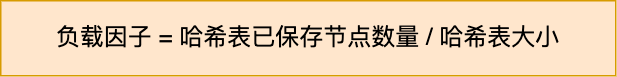

触发rehash操作的条件主要有以下两个

- 负载因子大于等于1时，并且Redis没有执行bgsave或bgrewiteaof命令，也就是没有执行RDB快照或没有进行AOF重写的时候，就会进行rehash操作
- 当负载因子大于等于5时，此时说明哈希冲突非常严重了，不管有没有在执行RDB快照或者AOF重写，都会强制执行rehash操作

## 整数集合

整数集合是Set对象的底层实现之一，当一个Set对象只包含整数值元素，并且元素数量不大时，就会使用整数集这个数据结构作为底层实现

### 整数集合结构设计

```
typedef struct intset {
    //编码方式
    uint32_t encoding;
    //集合包含的元素数量
    uint32_t length;
    //保存元素的数组
    int8_t contents[];
} intset;
```

## 跳表

Redis只有ZSet对象的底层实现用到了跳表，跳表的优势是能支持平均O(logN)复杂度的节点查找

zset结构体里只有两个数据结构，一个是跳表，一个是哈希表，这样的好处是既能进行高效的范围查找，也能进行搞笑的单点查询

```
typedef struct zset {
    dict *dict;
    zskiplist *zsl;
} zset;
```

Zset对象在执行数据插入或者数据更新的过程中，会一次在跳表和哈希表中插入或更新对应的数据，从而保证了跳表和哈希表中记录的信息一致

Zset对象能够支持范围查询，这是因为他的数据结构采用了跳表，而又能以常数复杂度获取元素权重，这是因为采用了哈希表进行索引，但是也只有获取元素权重时才使用哈希表来操作，其他操作都是基于跳表

### 1. 跳表结构设计

链表在查找元素的时候，因为需要逐一查找，所以查询效率很低，时间复杂度为O(N)，于是出现了跳表，跳表是在链表的基础上改进过来的，实现了一种多层的有序链表，这样的好处是能够快读定位数据

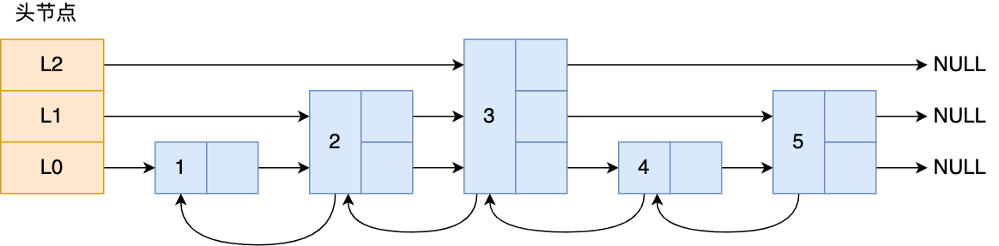

如果我们要在链表中查找节点 4 这个元素，只能从头开始遍历链表，需要查找 4 次，而使用了跳表后，只需要查找 2 次就能定位到节点 4，因为可以在头节点直接从 L2 层级跳到节点 3，然后再往前遍历找到节点 4。

可以看到，这个查找过程就是在多个层级上跳来跳去，最后定位到元素。当数据量很大时，跳表的查找复杂度就是 O(logN)。

```go
typedef struct zskiplistNode {
    //Zset 对象的元素值
    sds ele;
    //元素权重值
    double score;
    //后向指针
    struct zskiplistNode *backward;
    
    //节点的level数组，保存每层上的前向指针和跨度
    struct zskiplistLevel {
        struct zskiplistNode *forward;
        unsigned long span;
    } level[];
} zskiplistNode;
```

sds类型的ele变量代表Zset对象的元素，double类型的score代表元素的权重。每一个跳表节点都有一个后向指针(struct  zskiplistNode *backward)，指向前一个检点，目的是为了方便从跳表的尾结点开始访问节点，这样倒序查找时很方便。

跳表是一个带有层级关系的链表，而且每一级可以包含多个节点，每个节点通过指针连接起来，实现这一特性就是靠跳表节点结构体重的zskiplistLevel结构体类型的level数组。

level数组中的每一个元素代表跳表的一层，也就是由zskiplistLevel结构体标识，比如level[0]表示第一层，level[1]表示第二层，zskiplistLevel结构体定义了「指向下一个跳表节点的指针」和「跨度」,跨度用来记录两个节点之间的距离，**跨度实际上是为了计算这个节点在跳表中的排位**

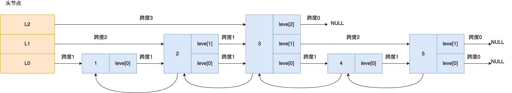

```go
typedef struct zskiplist {
    struct zskiplistNode *header, *tail;
    unsigned long length;
    int level;
} zskiplist;
```

**跳表结构里包含了**：

- 跳表的头尾节点，便于在O(1)时间复杂度内访问跳表的头节点和尾节点；
- 跳表的长度，便于在O(1)时间复杂度获取跳表节点的数量；
- 跳表的最大层数，便于在O(1)时间复杂度获取跳表中层高最大的那个节点的层数量；

### 2. 跳表的查询过程

查找一个跳表节点的过程时，跳表会从头节点的最高层开始，逐一遍历每一层。在遍历某一层的跳表节点时，会用跳表节点中的 SDS 类型的元素和元素的权重来进行判断，共有两个判断条件：

- 如果当前节点的权重「小于」要查找的权重时，跳表就会访问该层上的下一个节点。
- 如果当前节点的权重「等于」要查找的权重时，并且当前节点的 SDS 类型数据「小于」要查找的数据时，跳表就会访问该层上的下一个节点。

如果上面两个条件都不满足，或者下一个节点为空时，跳表就会使用目前遍历到的节点的 level 数组里的下一层指针，然后沿着下一层指针继续查找，这就相当于跳到了下一层接着查找。

举个例子，下图有个 3 层级的跳表。


如果要查找「元素：abcd，权重：4」的节点，查找的过程是这样的：

- 先从头节点的最高层开始，L2 指向了「元素：abc，权重：3」节点，这个节点的权重比要查找节点的小，所以要访问该层上的下一个节点；
- 但是该层的下一个节点是空节点（ leve[2]指向的是空节点），于是就会跳到「元素：abc，权重：3」节点的下一层去找，也就是 leve[1];
- 「元素：abc，权重：3」节点的 leve[1]  的下一个指针指向了「元素：abcde，权重：4」的节点，然后将其和要查找的节点比较。虽然「元素：abcde，权重：4」的节点的权重和要查找的权重相同，但是当前节点的 SDS 类型数据「大于」要查找的数据，所以会继续跳到「元素：abc，权重：3」节点的下一层去找，也就是 leve[0]；
- 「元素：abc，权重：3」节点的 leve[0] 的下一个指针指向了「元素：abcd，权重：4」的节点，该节点正是要查找的节点，查询结束。

### 3. 跳表节点层数设置

跳表的相邻两层的节点数量的比例会影响跳表的查询性能。

举个例子，下图的跳表，第二层的节点数量只有 1 个，而第一层的节点数量有 6 个。


这时，如果想要查询节点 6，那基本就跟链表的查询复杂度一样，就需要在第一层的节点中依次顺序查找，复杂度就是 O(N) 了。所以，为了降低查询复杂度，我们就需要维持相邻层结点数间的关系。

**跳表的相邻两层的节点数量最理想的比例是 2:1，查找复杂度可以降低到 O(logN)**。

下图的跳表就是，相邻两层的节点数量的比例是 2 : 1。


> 那怎样才能维持相邻两层的节点数量的比例为 2 : 1 呢？

如果采用新增节点或者删除节点时，来调整跳表节点以维持比例的方法的话，会带来额外的开销。

Redis 则采用一种巧妙的方法是，**跳表在创建节点的时候，随机生成每个节点的层数**，并没有严格维持相邻两层的节点数量比例为 2 : 1 的情况。

具体的做法是，**跳表在创建节点时候，会生成范围为[0-1]的一个随机数，如果这个随机数小于 0.25（相当于概率 25%），那么层数就增加 1 层，然后继续生成下一个随机数，直到随机数的结果大于 0.25 结束，最终确定该节点的层数**。

这样的做法，相当于每增加一层的概率不超过 25%，层数越高，概率越低，层高最大限制是 64。

**如果层高最大限制是 64，那么在创建跳表「头节点」的时候，就会直接创建 64 层高的头节点**。

### 4. 为什么用跳表而不用平衡树？

- **从内存占用上来比较，跳表比平衡树更灵活一些**。平衡树每个节点包含 2 个指针（分别指向左右子树），而跳表每个节点包含的指针数目平均为 1/(1-p)，具体取决于参数 p 的大小。如果像 Redis里的实现一样，取 p=1/4，那么平均每个节点包含 1.33 个指针，比平衡树更有优势。
- **在做范围查找的时候，跳表比平衡树操作要简单**。在平衡树上，我们找到指定范围的小值之后，还需要以中序遍历的顺序继续寻找其它不超过大值的节点。如果不对平衡树进行一定的改造，这里的中序遍历并不容易实现。而在跳表上进行范围查找就非常简单，只需要在找到小值之后，对第 1 层链表进行若干步的遍历就可以实现。
- **从算法实现难度上来比较，跳表比平衡树要简单得多**。平衡树的插入和删除操作可能引发子树的调整，逻辑复杂，而跳表的插入和删除只需要修改相邻节点的指针，操作简单又快速。

## quicklist

quicklistNode结构体里包含了前一个节点和下一个节点指针，这样每个quicklistNode形成了一个双向链表，但是链表节点的元素不再是单纯保存元素值，而是保存了一个压缩列表，所以quicklistNode结构体里有个指向压缩列表的指针。

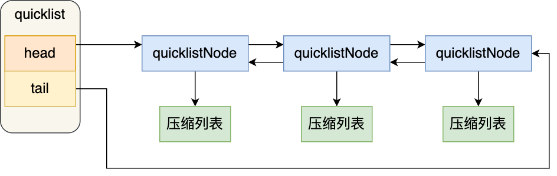

在向quicklist添加一个元素时，不会像普通链表那样，直接新建一个链表节点，而是会检查插入位置的压缩列表是否能容纳该元素，如果能容纳就直接保存到quicklistNode结构里压缩列表，如果不能容纳，才会新建一个quickListNode结构

quicklist会控制quicklistNode结构体里的压缩列表的大小或者元素个数，来规避潜在的连锁更新产生的风险，但是这并没有完全解决连锁更新的问题

## listpack

listpack采用了压缩列表的很多优秀设计，比如还是用一块连续的内存空间紧凑的保存数据，这样可以节省内存开销， 还会采用不同的编码方式来保存不同大小的数据

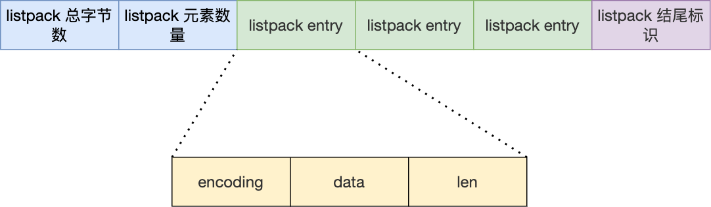

- listpack总字节数
- listpack元素数量
- listpack结尾标识
- encoding，定义该元素的编码类型，会根据不同长度的整数和字符串进行编码
- data：实际存放的数据
- len：encoding + data的总长度

可以看到listpack没有压缩列表中记录前一个节点长度的字段了，listpack只记录当前节点的长度，当我们像listpack加入一个新元素时，不会影响其他节点的长度字段的变化，从而避免了压缩列表的连锁更新问题

 
