# 持久化

## 1. AOF持久化

**AOF 文件的内容是操作命令**

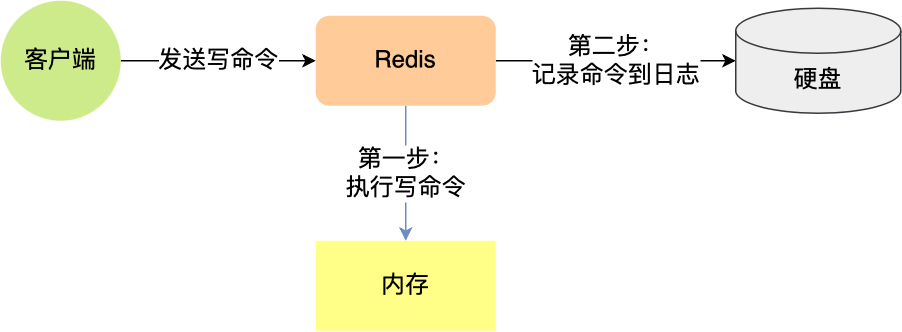

这种保存写操作命令到日志的持久化方式，就是AOF持久化方式（只记录写，不记录读）

Redis中AOF持久化功能默认是不开启的，需要修改`redis.conf`配置文件的参数：


### 1. AOF日志内容样例

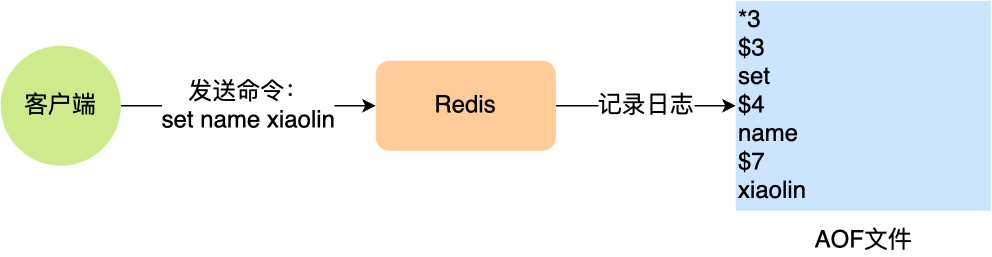

「`*3`」表示当前命令有三个部分，每部分都是以「`$+数字`」开头，后面紧跟着具体的命令、键或值。然后，这里的「`数字`」表示这部分中的命令、键或值一共有多少字节。例如，「`$3 set`」表示这部分有 3 个字节，也就是「`set`」命令这个字符串的长度。

### 2. Redis是先执行写操作后，才将命令记录到AOF日志内，这样做有两个好处

1. 避免额外的检查开销

   如果先记录，那么可能会把没有经过命令语法检查的命令记录到AOF日志，在Redis使用AOF恢复时就可能会出错，所以应该先执行，保证执行成功的命令才会被记录

2. 不会阻塞当前写操作命令的执行

### 3. AOF持久化的风险

1. 执行写操作命令和记录日志是两个过程，那当Redis在还没来得及将命令写入到磁盘时，服务器发生宕机了，这个**数据就会有丢失的风险**
2. 写操作命令执行成功后才记录到AOF日志，所以不会阻塞当前写操作执行，但是可能会给**下一个命令带来风险**

### 4. 三种写回策略

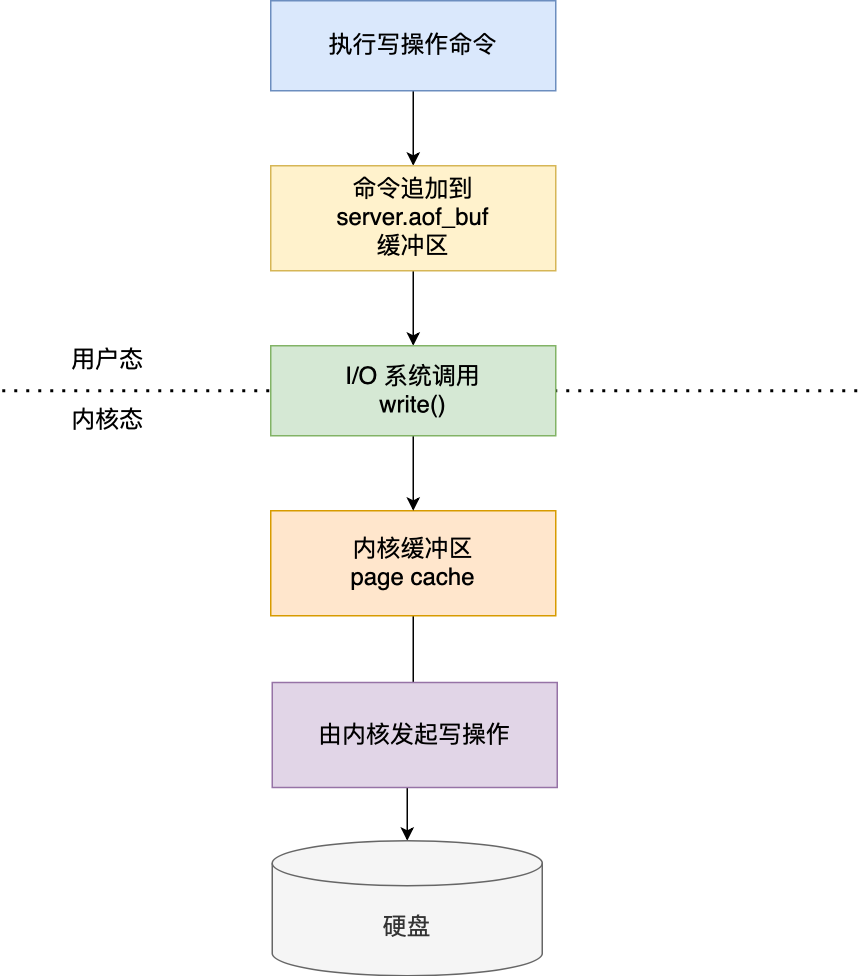

Redis写入AOF日志的过程：

1. Redis执行完写操作后，会把命令追加到`server.aof_buf`缓冲区
2. 通过write()系统调用，将aof_buf缓冲区的数据写入到AOF文件，此时数据并没有写入到硬盘，而是拷贝到了内核缓冲区page cache，等待内核将数据写入硬盘
3. 具体内核缓冲区的数据什么时候写入硬盘，由内核决定

内核写磁盘的三种策略是在`redis.conf`配置文件中的`appendfsync`配置项修改的：

- Always：「总是」,每次写操作命令执行完成后，同步将AOF日志数据写回硬盘
- Everysec：「每秒」每次写操作命令执行完成后，先将数据写入AOF文件的内核缓冲区，然后每隔一秒将缓冲区里的内容写回到磁盘
- No：「由操作系统决定」每次写操作命令执行完成后，先将数据写入AOF文件的内核缓冲区，再由操作系统决定何时将缓冲区内容写回硬盘

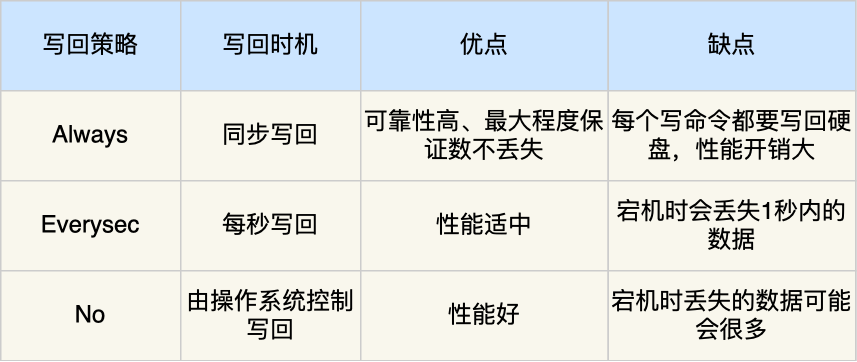

### 5. AOF重写机制

当Redis重启时，需要读AOF文件的内容以恢复数据，如果文件过大，恢复的过程就会很慢，带来性能问题。

AOF重写机制就是在重写时，读取当前数据库中所有键值对，然后将每一个键值对用一条命令记录到新的AOF文件，等到全部记录完后，就将新的AOF文件替换现有的AOF文件。

重写机制的妙处在于，尽管键值对被多条写命令反复修改，**最终也只需要根据这个「键值对」当前的最新状态，然后用一条命令去记录键值对**，替代之前记录这个键值对的多条命令，这样就减少了AOF文件中的命令数量，最后在重写工作完成后，将新的AOF文件覆盖现有的AOF文件。

Q：为什么重写的时候，不直接复用现有的AOF文件，而是先写道新的AOF文件再覆盖过去？

A：因为如果AOF重写失败了，现有的AOF文件就会被污染，可能无法用于恢复使用

## 2. RDB快照

RDB 文件的内容是二进制数据，记录某一瞬间内存的实际数据

### 1. 如何生成RDB

Redis提供了两个命令生成RDB文件，分别是`save`和`bgsave`

1. 执行`save`命令，就会在`主线程生成RDB文件`，由于和执行操作命令在同一个线程，所以如果写入RDB文件的时间太长，就会阻塞主线程
2. 执行`bgsave`命令，会创建一个`子进程来生成RDB文件`，这样可以避免主线程的阻塞

RDB是全量快照，每次执行快照，会把内存中`所有数据`都记录到磁盘中

### 2. RDB快照的缺点

RDB是每次间隔一段时间进行一次全量快照，如果执行太频繁会影响Redis性能，但如果执行间隔较长，在服务器发生故障时，丢失的数据会比AOF持久化的方式更多

Q：执行快照时，数据能被修改的吗？

A：可以，写时复制技术

## 3. 混合持久化

修改Redis配置来开启混合持久化

```
aof-use-rdb-preamble yes
```

混合持久化发生在AOF日志重写过程：

当开启了混合持久化，在AOF重写日志时，`fork`出来的重写子进程会先将与主线程共享的内存数据以RDB方式写入到AOF文件，然后主线程处理的操作命令会被记录在重写缓冲区里，重写缓冲区里的增量命令会以AOF方式写入到AOF文件，写入完成后通知主进程将新的含有RDB格式和AOF格式的AOF文件替换旧的AOF文件

```
实际数据RDB->写入AOF文件->主线程的操作命令写入缓冲区AOF->AOF文件->共同写入AOF->替换旧AOF
```

就是说，使用了混合持久化，AOF文件的前半部分是RDB格式的全量数据，后半部分是AOF格式的增量数据

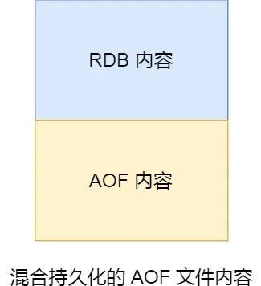

这样的好处在于，重启Redis加载数据的时候，由于前半部分是RDB内容，这样加载的速度就会很快，加载完RDB内容后，才会加载后半部分的AOF内容，这里的内容是Redis后台子进程重写AOF期间，主线程处理的操作命令，可以使得数据更少的丢失

### 4. Redis大key对AOF日志的影响

### 1. 对于AOF持久化三种策略的影响

1. **当使用 Always 策略的时候，如果写入是一个大 Key，主线程在执行 fsync() 函数的时候，阻塞的时间会比较久，因为当写入的数据量很大的时候，数据同步到硬盘这个过程是很耗时的**。

1. 当使用 Everysec 策略的时候，由于是异步执行 fsync() 函数，所以大 Key 持久化的过程（数据同步磁盘）不会影响主线程。

1. 当使用 No 策略的时候，由于永不执行 fsync() 函数，所以大 Key 持久化的过程不会影响主线程

AOF重写机制和RDB快照的过程，都会分别通过fork()函数创建一个子进程来处理任务，会有两个阶段会导致阻塞父进程

- 创建子进程时，由于要复制父进程的页等数据结构，阻塞的时间和页面的大小有关，页表越大，阻塞时间越长
- 创建完子进程后，如果父进程修改了共享数据中的大key，就会发生写时复制，这期间拷贝物理内存，由于大key占用的物理内存会很大，所以在复制物理内存这一过程就会比较耗时，所以有可能会阻塞父进程

### 2. 大key除了会影响持久化之外，还会有以下影响

- **客户端超时阻塞**，由于Redis执行命令是单线程处理的，然后在操作大key时会比较耗时，那么就会阻塞Redis
- **引发网络阻塞**，每次获取大key产生的网络流量较大，如果一个key的大小是1MB，每次访问量为1000，那么每秒会产生1000MB的流量，这对于普通千兆网卡的服务器来说是灾难性的
- **阻塞工作线程**，如果使用del删除大key时，会阻塞工作线程，这样就没办法处理后续的命令
- **内存分配不均**，集群模型在slot分片均匀的情况下，会出现数据和查询倾斜的情况，部分有大key的Redis节点占用内存多，QPS也会比较大

### 3. 如果避免大key

就会把大key拆分一个一个小key，或者定时检查Redis是否存在大Key。或者，定时检查Redis是否存在大key，如果该大key是可以删除的，不要使用Del命令删除，因为该命令删除过程中会造成阻塞主线程，使用unlink命令删除大key，因为该命令的删除过程是异步的，不会阻塞主线程。

# Redis过期删除策略

Redis 是可以对 key 设置过期时间的，因此需要有相应的机制将已过期的键值对删除，而做这个工作的就是过期键值删除策略。

## 1. 如何设置过期时间？

------

### 1. 对 key 设置过期时间的命令

1. `expire <key> <n>`：**设置 key 在 n 秒后过期**，比如 expire key 100 表示设置 key 在 100 秒后过期；
2. `pexpire <key> <n>`：**设置 key 在 n 毫秒后过期**，比如 pexpire key2 100000 表示设置 key2 在 100000 毫秒（100 秒）后过期。
3. `expireat <key> <n>`：**设置 key 在某个时间戳（精确到秒）之后过期**，比如 expireat key3 1655654400 表示 key3 在时间戳 1655654400 后过期（精确到秒）；
4. `pexpireat <key> <n>`：**设置 key 在某个时间戳（精确到毫秒）之后过期**，比如 pexpireat key4 1655654400000 表示 key4 在时间戳 1655654400000 后过期（精确到毫秒）

### 2. 设置字符串时，也可以同时对 key 设置过期时间

1. `set <key> <value> ex <n>` ：设置键值对的时候，同时指定过期时间（精确到秒）；
2. `set <key> <value> px <n>` ：设置键值对的时候，同时指定过期时间（精确到毫秒）；
3. `setex <key> <n> <valule>` ：设置键值对的时候，同时指定过期时间（精确到秒）。

`TTL <key>`查看某个 key 剩余的存活时间

`PERSIST <key>` 取消 key 的过期时间，则可以使用

## 2. 过期删除策略

### 1. 定时删除

**在设置 key 的过期时间时，同时创建一个定时事件，当时间到达时，由事件处理器自动执行 key 的删除操作**。

优点：保证过期的key立刻删除，内存会第一时间释放

缺点：过期key较多的情况下，删除key也会占用一部分CPU资源，对服务器的吞吐量和响应时间造成影响

### 2. 惰性删除

**不主动删除过期键，每次当key被访问时，会检测key是否过期，如果过期会删除key**。

优点：每次访问时，才检查key是否过期，所以占用CPU资源少

缺点：如果一个key已经过期，但是他仍然保留在数据库中浪费空间

### 3. 定期删除

**每隔一段时间随机从数据库中取出一定数量的key进行检查，并删除其中过期key**。

优点：

​	通过限制删除操作的执行时长和频率，减少删除操作对CPU的影响，同时也能删除一部分过期的数据减少了过期键对空间的浪费

缺点：

- 难以确定删除操作的执行时长和频率，太频繁会占用CPU资源，太少，过期的key占用的内存不会及时释放
- 内存清理没有定时删除好，有没有惰性删除使用的系统资源少

### 4. 惰性删除+定期删除

Redis选择**惰性删除 + 定期删除**这两种策略配合使用，以求在合理使用CPU时间和浪费资源之间取得平衡

1. 定期删除的间隔时间设置多少？

   Redis默认每秒进行10次过期检查一次数据库，此配置可通过Redis的配置文件redis.conf进行配置，配置键为hz

   **每次检查数据库是随机抽查，不是查询全部！**

2. 随机抽查的数量是多少？

固定20

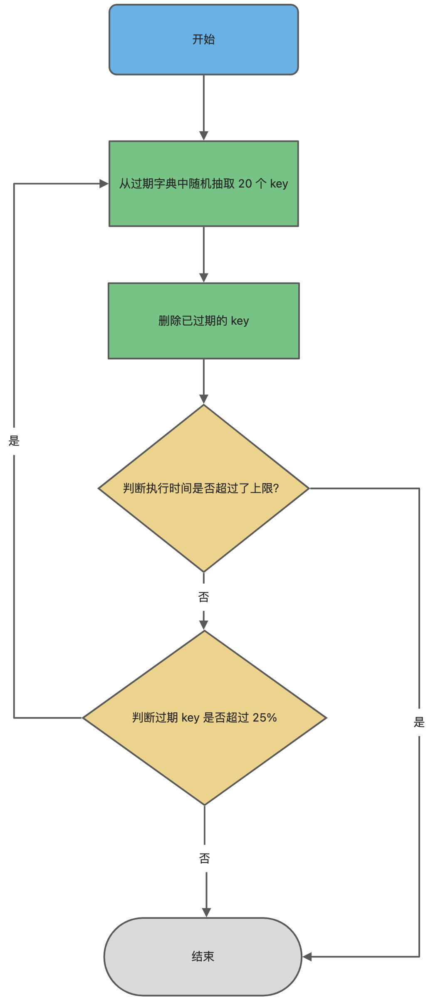

流程：

1. 从过期字典中随机抽查20个key
2. 检查这20个key是否过期，并删除已过期的key
3. 如果本轮检查的已过期key的数量，超过5(20/4)个，也就是（已过期的key数量）/（随机抽取的key数量）大于25%，则继续本轮抽查，否则将等待下一轮抽查

```
这是一个循环流程，但是为了防止循环过度，线程卡死现象，为此增加了定期删除循环流程的时间上线，默认不超过25ms
```

# Redis内存淘汰策略

- **volatile-random**：随机淘汰设置了过期时间的任意键值；
- **volatile-ttl**：优先淘汰更早过期的键值。
- **volatile-lru**（Redis3.0 之前，默认的内存淘汰策略）：淘汰所有设置了过期时间的键值中，最久未使用的键值；
- **volatile-lfu**（Redis 4.0 后新增的内存淘汰策略）：淘汰所有设置了过期时间的键值中，最少使用的键值；

在所有数据范围内进行淘汰：

- **allkeys-random**：随机淘汰任意键值;
- **allkeys-lru**：淘汰整个键值中最久未使用的键值；
- **allkeys-lfu**（Redis 4.0 后新增的内存淘汰策略）：淘汰整个键值中最少使用的键值。

# 缓存

缓存异常的三个问题：

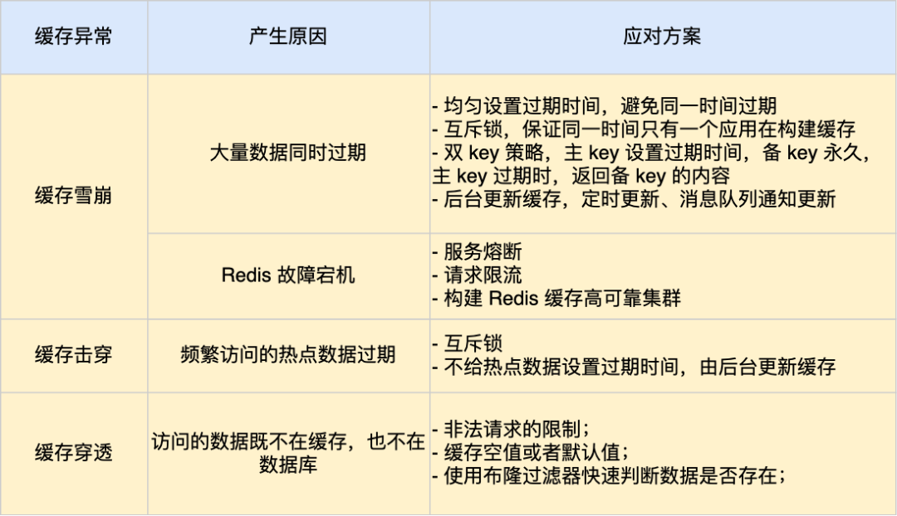

缓存数据查询流程：

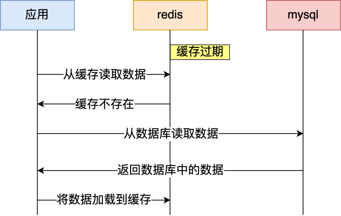

### 1. 缓存雪崩

#### 1. 产生原因

当大量缓存数据在同一时间过期（失效）或者Redis故障宕机，此时如果有大量用户请求，都无法在Redis中处理，于是全部请求都直接访问数据库，导致数据库压力暴增，系统瘫痪。

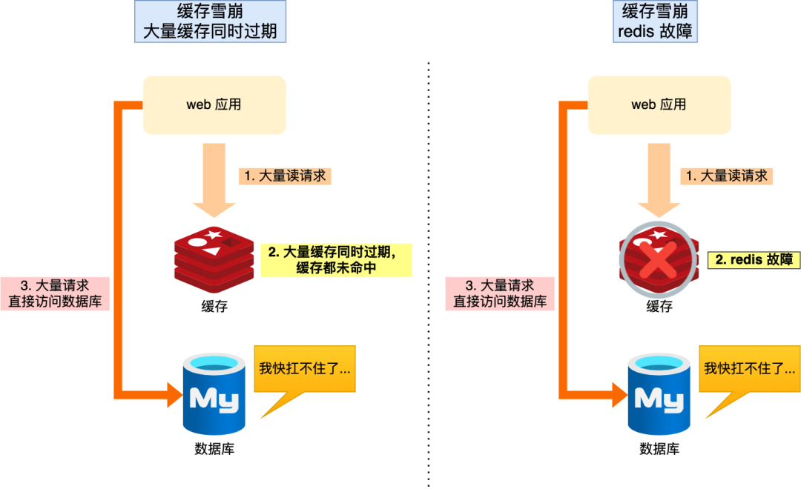

#### 2. 解决方案

1. 针对大量数据同时过期的问题

   - 均匀设置过期时间

     在对缓存数据设置过期时间时，**给这些数据的过期时间加一个随机数**，避免大量的数据同一个时间过期

   - 互斥锁

     如果业务线程在请求时，**发现要访问的数据并不在Redis中，就加个互斥锁，保证同一时间只有一个请求来构建缓存**，缓存构建完成后再释放锁，没能拿到互斥锁的请求，要么等待锁释放后重新读取，要么返回空值或者默认值。

     实现互斥锁，最好设置超时时间，不然如果第一个请求拿到了锁而发生意外一直没有释放锁，那就会导致其他请求也拿不到锁阻塞

   - 后台更新缓存

     不再对缓存设置有效期，把对缓存的更新工作交给后台线程定时更新，但是当系统内存紧张时，这条数据还是可能会被淘汰，导致业务线程读取失败返回空值。

     解决该问题的方案

     - 频繁检测缓存是否有效，但是检测间隔不能太长，如果太长会导致数据是一个空值，最好设置毫秒级，但是毫秒级也总归是个时间间隔，用户体验一般
     - 业务线程发现缓存数据失效后（缓存数据被淘汰），通过消息队列发送一条消息通知后台线程更新缓存，后台线程如果发现缓存存在则不更新缓存，不存在，就读取数据库数据加载到缓存

   ```
   缓存预热：提前将需要缓存的数据缓存到Redis中，不要等到用户访问再去构建缓存
   ```

2. Redis故障宕机

   - 服务熔断或请求限流限制

     当Redis故障宕机而导致缓存雪崩时，可以启动**服务熔断机制**，暂停业务对缓存的访问，直接报错，但是服务熔断，**会导致全部业务都无法正常工作**，为了减少对业务的影响，启用**请求限流机制**，只将**少部分请求发送到数据库中处理**，其他请求在入口处直接拒绝，等Redis恢复正常并把缓存预热完成后，再解除请求限流机制

   - 构建缓存高可靠集群

     通过主从节点的方式构建Redis缓存高可靠集群，如果Redis缓存的主节点故障宕机，将从节点切换到主节点，继续提供服务

## 2. 缓存击穿

#### 1. 产生原因

大量热点数据同时过期了，此时大量的求情访问了该热点数据，就无法从缓存中读取，直接访问数据库，数据库很容易就会被高并发冲垮。

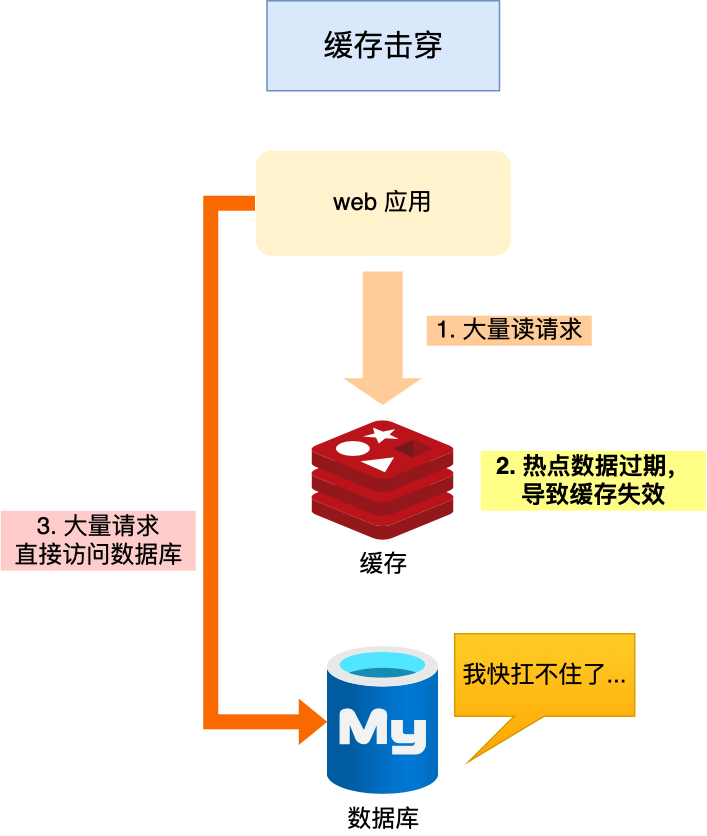

#### 2. 解决方案

- **互斥锁**，同一时间保证只有一个线程更新缓存
- 不设置缓存的过期时间，由**后台异步更新缓存**，或者在热点数据要过期前，提前通过**后台线程更新缓存以及重新设置过期时间**

## 3. 缓存穿透

#### 1. 产生原因

用户访问数据时，**数据既不在缓存中也不在数据库中**

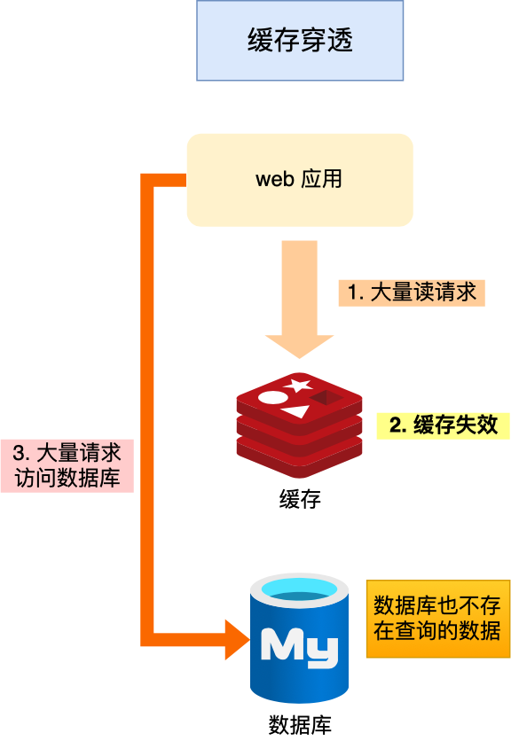

#### 2. 解决方案

产生缓存穿透一般有可能是两种情况

- 业务误操作，缓存和数据库中的数据都被误删除了
- 黑客恶意攻击，故意大量访问某些读取不存数据的业务

应对方式有三种

- 限制非法请求

  在API入口处判断请求参数是否合法，请求字段是否存在等，如果是恶意请求则直接返回报错

- 缓存空值或者默认值

  如果请求没有在缓存中查询到，就返回空值或默认值，不会继续查询数据库

- 布隆过滤器

  布隆过滤器由「初始值都为 0 的位图数组」和「 N 个哈希函数」两部分组成。当我们在写入数据库数据时，在布隆过滤器里做个标记，这样下次查询数据是否在数据库时，只需要查询布隆过滤器，如果查询到数据没有被标记，说明不在数据库中。

  布隆过滤器会通过 3 个操作完成标记：

  - 第一步，使用 N 个哈希函数分别对数据做哈希计算，得到 N 个哈希值；
  - 第二步，将第一步得到的 N 个哈希值对位图数组的长度取模，得到每个哈希值在位图数组的对应位置。
  - 第三步，将每个哈希值在位图数组的对应位置的值设置为 1；

  举个例子，假设有一个位图数组长度为 8，哈希函数 3 个的布隆过滤器。

  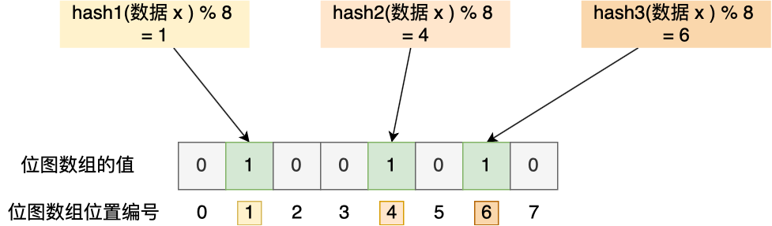

  在数据库写入数据 x 后，把数据 x 标记在布隆过滤器时，数据 x 会被 3 个哈希函数分别计算出 3 个哈希值，然后在对这 3 个哈希值对 8 取模，假设取模的结果为 1、4、6，然后把位图数组的第 1、4、6 位置的值设置为 1。**当应用要查询数据 x 是否数据库时，通过布隆过滤器只要查到位图数组的第 1、4、6 位置的值是否全为 1，只要有一个为 0，就认为数据 x 不在数据库中**。

  布隆过滤器由于是基于哈希函数实现查找的，高效查找的同时**存在哈希冲突的可能性**，比如数据 x 和数据 y 可能都落在第 1、4、6 位置，而事实上，可能数据库中并不存在数据 y，存在误判的情况。

  所以，**查询布隆过滤器说数据存在，并不一定证明数据库中存在这个数据，但是查询到数据不存在，数据库中一定就不存在这个数据**。

# 数据库和缓存一致性问题

### 1. 问题剖析

最优方案是「**先更新数据库，再删缓存**」，但是仍然有两个问题

1. 在这个「**读 + 写」**的并发操作里，还是可能会产生缓存不一致的问题，解决办法是「**延迟双删**」
2. 如果在删除缓存时失败了，导致缓存中仍是旧值，数据库中是新值的不一致问题，解决方法是「**设置过期时间**」
3. 但是设置过期时间，还会导致延迟的问题

问题的根本还是「**如何能够保证读写两个操作都能成功**」？

先回到最开始的问题场景

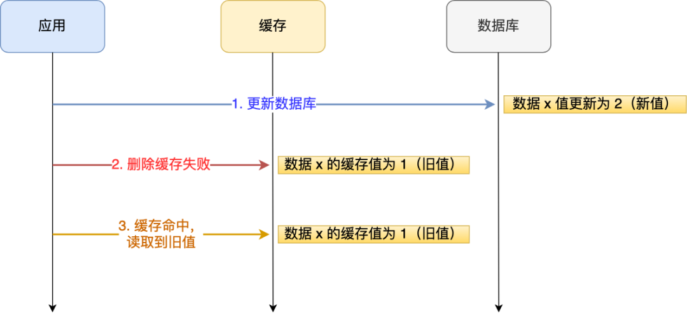

### 2. 解决方案：

1. 重试机制

   引入**消息队列**，将删除缓存要操作的数据加入到消息队列，有消费者操作数据

   - 如果删除缓存成功，同时把消息队列中的数据也删除，避免重复操作
   - 如果删除缓存失败，可以从消息队列中重新读取数据，然后再次删除缓存，这个就是**重试机制**。

   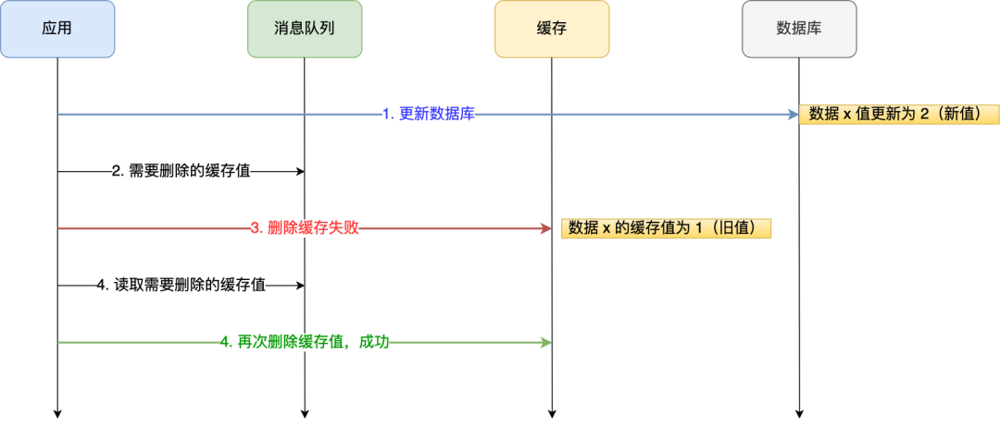

2. 订阅Mysql binlog，再操作缓存

   「**先更新数据库，再删缓存**」的策略的第一步是更新数据库，那么更新数据库成功，就会产生一条变更日志，记录在 binlog 里。

   于是我们就可以通过订阅 binlog 日志，拿到具体要操作的数据，然后再执行缓存删除，阿里巴巴开源的 Canal 中间件就是基于这个实现的。

> 为什么是删除缓存，而不是更新缓存呢？

删除一个数据，相比更新一个数据更加轻量级，出问题的概率更小。在实际业务中，缓存的数据可能不是直接来自数据库表，也许来自多张底层数据表的聚合。

比如商品详情信息，在底层可能会关联商品表、价格表、库存表等，如果更新了一个价格字段，那么就要更新整个数据库，还要关联的去查询和汇总各个周边业务系统的数据，这个操作会非常耗时。  从另外一个角度，不是所有的缓存数据都是频繁访问的，更新后的缓存可能会长时间不被访问，所以说，从计算资源和整体性能的考虑，更新的时候删除缓存，等到下次查询命中再填充缓存，是一个更好的方案。

系统设计中有一个思想叫 `Lazy Loading`，适用于那些加载代价大的操作，删除缓存而不是更新缓存，就是懒加载思想的一个应用。
