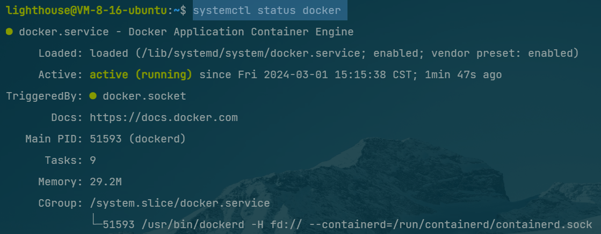
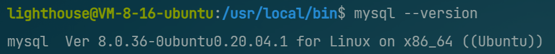
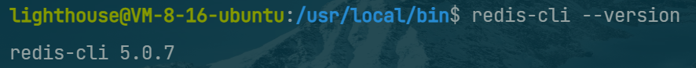

#  

# 腾讯云服务器搭建

腾讯云轻量服务器 + `Ubuntu Server 22.04 LTS 64bit`

## 1. 安装docker（1.03GB）

1. 更新一下软件源和软件列表

   ```
   sudo apt-get update
   sudo apt-get upgrade
   ```

2. 添加[HTTPS协议](https://so.csdn.net/so/search?q=HTTPS协议&spm=1001.2101.3001.7020)，允许apt从HTTPS安装软件包

   ```
   sudo apt-get install apt-transport-https ca-certificates curl software-properties-common
   ```

3. 添加Docker公共密钥 Docker 官方源

   ```
   curl -fsSL https://download.docker.com/linux/ubuntu/gpg | sudo apt-key add
   ```

4. 设置版本库类型，软件版本包括三种： stable、edge、test

   ```
   sudo add-apt-repository "deb [arch=amd64] https://download.docker.com/linux/ubuntu $(lsb_release -cs) stable"
   ```

5. 安装最新版docker-ce

   ```
   sudo apt-get install docker-ce
   ```

6. 设置开机自启动并启动docker

   ```
   sudo systemctl enable docker
   sudo systemctl start docker
   ```

7. 查看docker状态

   ```
   systemctl status docker
   ```

   运行成功示例

   

## 2. 安装docker-composs（0.06G）

1. 使用`curl`将 Compose 文件下载到`/usr/local/bin`目录：

   ```
   sudo curl -L "https://github.com/docker/compose/releases/download/1.25.5/docker-compose-$(uname -s)-$(uname -m)" -o /usr/local/bin/docker-compose
   ```

2. 下载完成后，将该文件设置为可执行：

   ```
   sudo chmod +x /usr/local/bin/docker-compose
   ```

3. 打印 Compose 的版本，验证安装是否成功：

   ```
   docker-compose --version
   ```

   

## 3. 安装Mysql

1. 安装Mysql

   ```
   sudo apt-get install mysql-server mysql-client
   ```

2. 验证安装是否成功

   ```
   mysql --version
   ```

   

## 4. 安装Redis

1. 安装Redis

   ```
   sudo apt install redis
   ```

2. 验证安装是否成功

   ```
   redis-cli --version
   ```


   
